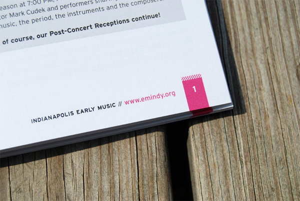
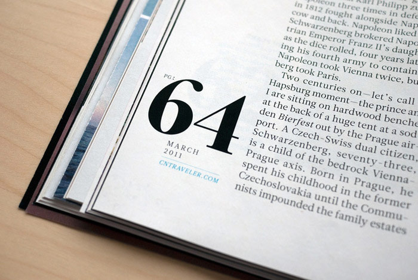
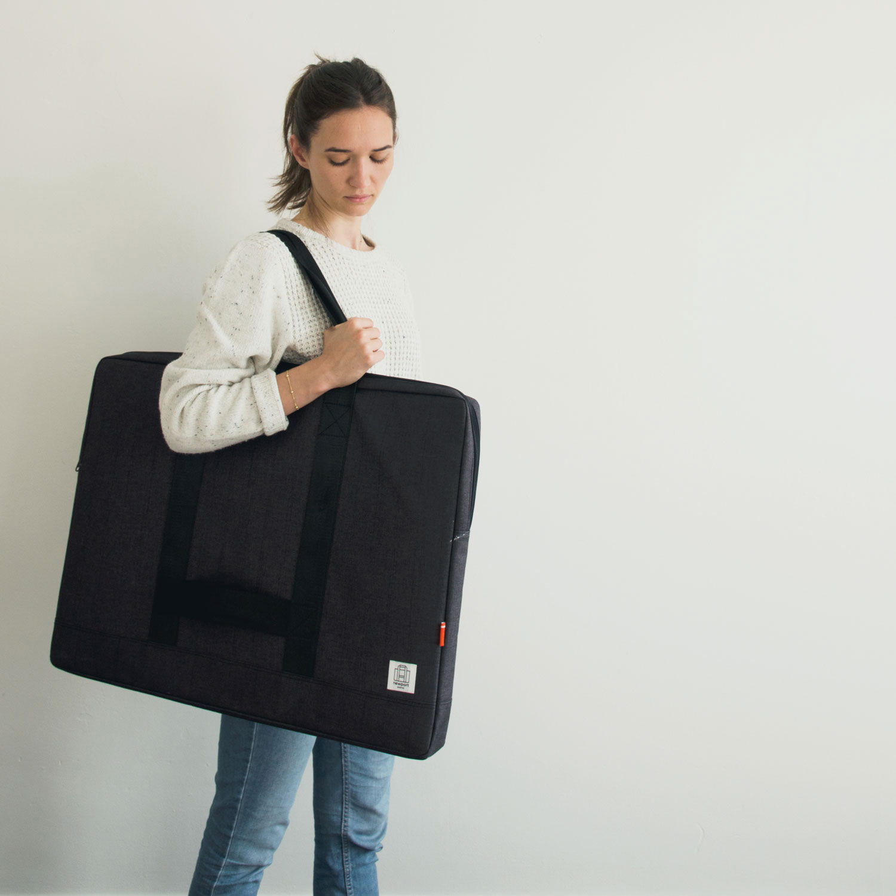
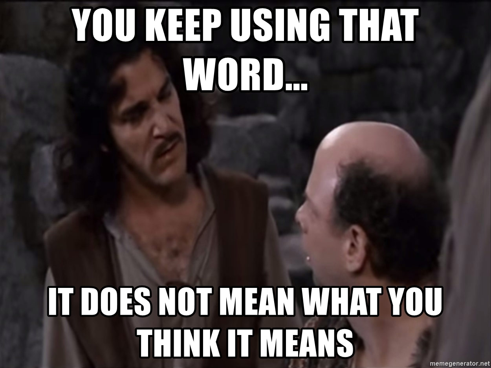

## _Folio_ in design context

A traditional graphic designer might tell you folio means page numbering. A printer might tell you it means a printed sheet or its folded sizes. In any case, the term _folio_ in print design has something to do with producing multiple pages of editorial layout.

### A printed page number

It's a functional element. Any printed material with more pages than a handful could use a page number—not just a book, but also contracts, syllabi, or just about anything that has text worth referring to printed over multiple pages. A folio makes it possible to say things like "_According to the Exhibit B on printed 175,_" or "_Let's pick up where we left off on chapter 3 at page 235._"

At bare minumum, a folio is a printed page number that works as a way finder. Often, however, a folio might contain multiple additional elements (_e.g. book title, chapter number, chapter title, published date, etc._).

_A folio with publication title, web address, and page number (image source: [underconsideration.com](https://www.underconsideration.com/fpo/archives/2010/07/indianapolis-early-music-program.php))_

It's also an expressive design element, with which designers subtly show off their typographic composition skills and attention to detail on a page. A well-designed and well-crafted folio is a turn-on for many designers.

_A sophisticated folio with asymmetrical composition (image source: [fontsinuse.com](https://fontsinuse.com/uses/35/esquire-and-conde-nast-traveler))_

### A sheet of paper for book binding

In this context, a _folio_ means a full single sheet of paper, which is then folded in half and bound at the center fold to make a book. While I have to confess that I've never personally _used_ those latin words at work (as explained in the illustration below), over the years I _have produced_ countless of saddle-stitch booklets in a variety of sizes and can attest that it's a concept widely in use.

_The Folio: printing, folding and cutting, compared to the quarto and octavo. (image source: [Wikipedia](https://upload.wikimedia.org/wikipedia/commons/8/8c/Folio-Quarto-Octavo_Compared.svg))_

## <i>Port</i>folio in design context

<blockquote class="pullquote qr">
  A portfolio is a large, flat briefcase used to hold papers and other loose
  materials.
   
  <small>
    —{" "}
    <a href="https://www.vocabulary.com/dictionary/portfolio">vocabulary.com</a>
  </small>
</blockquote>

Wikipedia's definition of [artist's portfolio](https://en.wikipedia.org/wiki/Artist%27s_portfolio) reads applicable here. A design portfolio is an _edited collection of a person's best design work intended to showcase their style or method of work_. The goal is to show potential employers and clients their versatility and professionalism.

Today a portfolio is typically assumed to be a digital format—be it a <small>PDF</small>, a website, or a video reel—rather than a printed collection. But even just ten years ago it was still common to bring physical, printed design samples to job interviews: posters, booklets, brochures, letterheads, whatever. To carry those large-size prints, people needed even larger-size briefcases: the _portfolio case_.

_A portfolio case (image source: [progresspackaging.co.uk](https://www.progresspackaging.co.uk/custom-made-portfolio-case-newport-works/))_

### Etymology of Portfolio

_Porta_- means “to carry” and _folio_ “a sheet of paper.” By origin _portfolio_ just means [a case for carrying loose papers](https://www.etymonline.com/word/portfolio). Through the particular use case of designers and artists, the word started to mean “a collection of selected work samples (often carried _in_ those cases).”

My professional work samples now reside digitally—presented on my website, managed on GitHub, and hosted via Netlify. Even the print design works are shown as <small>PDF</small>s or <small>JPG</small>s. If anything, I'd bring my laptop or iPhone to an interview to showcase interactive pieces. So, in a _literal_ sense, I don't have a portfolio.

## TL;DR

- **Folio** is
  - a sheet of paper used for printing, and
  - as a related concept, a page number printed on a page.
- **Portfolio** is
  - a case to carry those sheets of paper, and
  - by convention, a curated collection of professional work samples.

Yeah, I know a language is an organic, ever-changing system, and words carry different meanings over time. But I cannot yet agree that _folio_ can mean _portfolio_ in the context of design profession. Not after having designed a ton of _folios_ (page numbering) to be printed on lots of _folios_ (sheets of paper) to be carried in _portfolio_ (case) as my _portfolio_ (work samples).

Don't mind me. You can keep saying _folio_ to mean _portfolio_. Just know that the word doesn't mean what you think it means.

_Inigo Montoya says... (image source: [memegenerator.net](https://memegenerator.net/instance/79794116/inigo-montoya-actual-you-keep-using-that-word-it-does-not-mean-what-you-think-it-means))_
