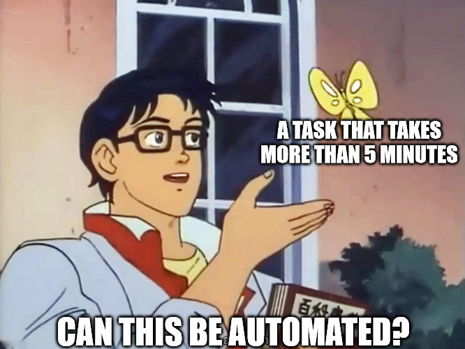
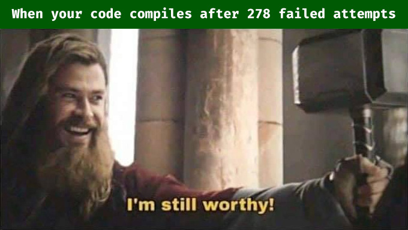

_Code often helps save time. Just not always._

## Productivity, perhaps

To be extra clear, by _writing code_ I mean _writing instructions to a machine_—rather than converting a message into a particular symbol system. And this definition naturally implies automation or/and efficiency, which is often an excellent reason for writing code that _does something_.

I know of a copyright lawyer who uses terminal and bash scripting to automate many of his mundane busy work. A school teacher once told me she had written a simple script to streamline her grading process. When a task at hand requires monotonous repetition or/and substantial data handling, there’s a good chance coding can help.

## Beyond practicality

_Ain’t it rewarding?_

Some might argue, however, they write code _just because_. It’s probably a valid reason as well. Just like cooking, drawing, driving, or any other hobbies, coding can be a _fun thing to do_ with its outcome being just a side effect. When I first started <small>BASIC</small> programming in the third grade, it was purely a fun activity with no practical purposes whatsoever.

Writing code very much resembles solving a puzzle—i.e. requiring to accomplish a particular goal by following a particular and strict set of rules—and is a challenging yet addictive entertainment for many.

## Coding as a fundamental skill

I’d take one step further and argue that writing code embodies something even more fundamental. The _skills_ of reading and writing code might be similar—and serve similar purposes—to reading and writing in general. The _act_ of writing code code might be in the same behavioral—_meditative_—category as running or playing music. Practicality and enjoyement are important parts of why, but not the most elemental.

### Why teach kids how to read and write?

We don’t necessary hope our kids grow up to be professional writers when teaching them how to read and write. Rather, it’s to enable them to understand the world and continue to build their framework of life. Literacy opens doors to new opportunities that are otherwise not present. Written sentences are what the world is made of. It’s how we communicate with the world, everyone in it, and ourselves in different points in time. It’s how the world operates and how we make sense of it. For that matter, style, grammar, or even vocabulary are secondary; you just have to know the fundamentals to participate.

### To see the world

Code is very much like that. It’s how logic and behavior of machines are organized. Understanding its fundamentals enables people to better understand why machines work the way they work. Whether it’s a parking meter, an elevator, a car, or an iPad that you’re handling, you’re interacting with its code. The more you _see_ it, the more equipped you are. You don’t have to be a programmer to benefit from such Neo-like vision. In fact, the actual programming skills aren’t too relevant in this sense.

_See the Matrix... (image source: The Matrix)_

## Play the piano, press the keys

You don’t have to know about a [tetrachord](https://en.wikipedia.org/wiki/Tetrachord) or a [chord progression](https://en.wikipedia.org/wiki/Chord_progression) to appreciate good music, but having such knowledge will expand your sensibility. Practicing piano will help you become more aware of subtle nuances not just in music but everyday soundscape in general. Even if you don’t become a professional musician, there’s a profound value in acquiring musical skills.

Do you write code? If not, you might want to start. If not to increase your hirability, just to be a better version of yourself.
