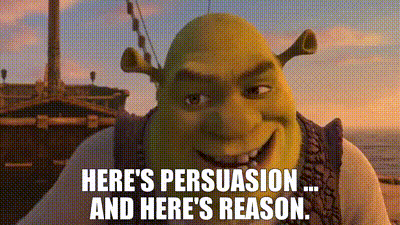

## Quality doesn’t sell itself

It’s a common misconception not limited to design. Some argue that good work will sell itself because people recognize quality. They might also say that high quality is sufficient marketing. They’re trolling, lying, or naïve—in any case, incorrect by common sense. Great products fail and exceptional ideas get shut down _all the time_. Quality isn’t a single factor in determining success—not in business, not in marketing, and definitely not in design.

### What is quality anyway?

_Looks good to me (image source: [imgflip](https://imgflip.com/i/36j16g))_

What makes a watch a _quality_ watch? What about a car, a film, or an ad? What determines _quality_ and how objective is it? Who makes that call? Because quality is a multi-axial measurement, a simple quality score often fails. Would you trust _every_ Yelp rating or Amazon review to be true to your own taste?

Even when there are conventional criteria, it’s almost never _objectively_ quantifiable. Because quality _is_ ultimately subjective at least in the consumption context. An epic movie to some is garbage to others, a legendary game to some is boring to others, and a dream car for some is a poor taste to others.

Design isn’t any different. The quality of a design can be measured in a myriad of standards—aesthetics, usability, readability, uniqueness, typography, grid system, use of colors, subject matter interpretation, and whatever else. One might rightfully argue, many _professionally trained designers_ tend to share common standards to judge a design. Do you know who _aren’t_ professionally trained though? Your stakeholders, your audience—those who approve and consume the design work. _They_ determine quality; _not you_ the designer.

### Persuasion, not mathematics

_Power of persuasion (image source: Shrek the Third)_

I’m not denying that quality is important. It is a fundamentally critical factor, because audience actually _do_ appreciate the design quality. Apple products—both hardware and software—are loved for their streamlined aesthetics and intuitive interface. Microsoft products are admired for their configurability, extensibility, and compatibility. People swear by Apple and Microsoft’s works (albeit not simultaneously). Different sets of quality appeal to different audiences—and to the same audience at different points in time.

Delivering a design solution is more a persuasive process than calculative. You may think your impeccable design will speak for itself, but trust me, it won’t. Whatever the design decisions, you’d _have to_ have a reason and be ready and willing to explain. If you forgo the persuasion aspect, you’re nothing more than executing hands. Hey, maybe your manager or their manager could do it for you, but you cannot expect others to sell _your design_ better than you.

Believe it or not, even the most telling A/B test result doesn’t always cut it. Quality data, quality research, quality design, and quality work can—and _will_—amount to nothing if you cannot convince the stakeholders. Listen actively and speak eloquently. Be willing to _be persuaded_ yourself, and adjust your design based on the feedback. That’s how you grow as a designer.

## Like it or not, you’re in sales

While I’ve never been in a sales role, I have a great respect for the profession. As a salesperson, you need to know what you’re selling, what the buyer’s problems are, how your product solves their problems, what’s stopping them from buying, and how to remove the stopper—all the while building the relationship upon trust. Also, equally importantly, you need to know when to stop pursuing the sales if it’s not the right fit.

A designer needs to do the same. Know what’s the problem is (and build a solution), articulate how your design solves it, learn why they’d object to the proposed solution, and address the objection. Do be willing to change your mind too. As soon as it’s clear that your solution is incomplete, stop forcing it and iterate.

### Step up your sales game

Yes, you need to hone your design skills. No, you’re not exempt from explaining your decisions. As an entry level designer—and also because English is my second language—I used to shy away from speaking up and be grumpy when people didn’t _get_ my design solution. It took almost two painful years until I truly realized that they _wanted_ more explanation and persuasion. That when I spoke, they did listen and accept. That when they disagree to my solution, there were valid reasons and I needed to fix _my_ solution. When you avoid meetings, presentations, and _selling_, you can’t do any of that.

Keep on making awesome designs. Start building sales chops. Your future self will thank you.
