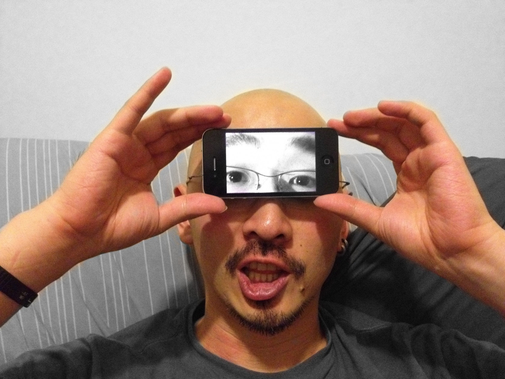
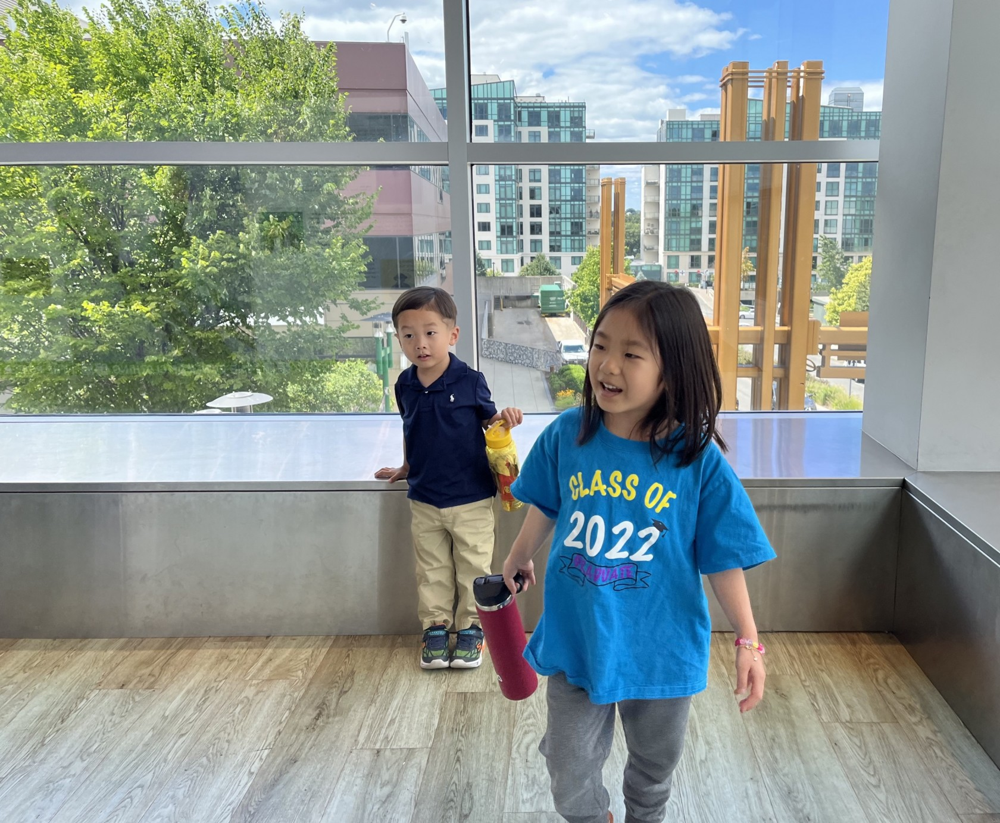
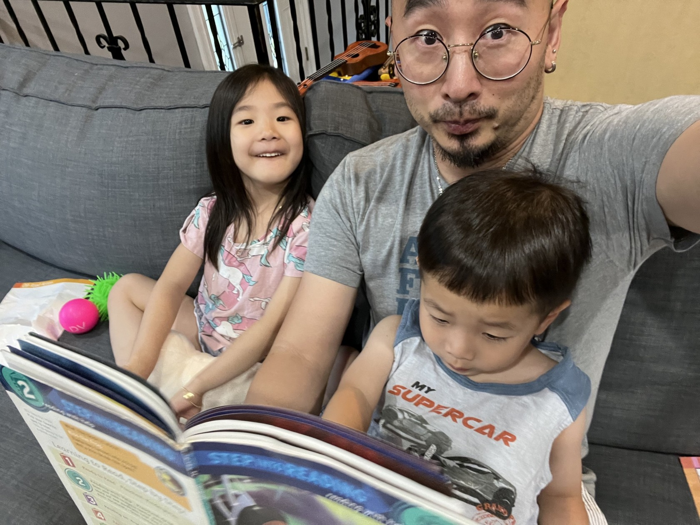

import {
  SimpleButton,
  ButtonContainer,
} from "../../../components/SimpleButton";

## What led you into design?

<blockquote class="pullquote qr">
  I just kept following the expected path into academia... until I finaly called
  it quits.
</blockquote>

Drawing, building, making, and crafting have always been my passion since childhood, but growing up in a family of academics I didn't realize that _making things_ can be a career option until in my late 20s. I just kept following the expected path into academia—getting my degrees in linguistics and psychology, spening a year in psychology grad school (and dropping off), and persuing medical degree (and quitting)—until I finally called it quits.

During those years I took random jobs just to make money—tutoring middle school kids, translating books and documents, working as typist, and then some. Funnily enough, I was often rejected for being _overqualified_ for simpler jobs like convenient store cashier or hostel receptionist, and had to find niche areas for employment. Translating/interpreting in broadcasting industry turned out to be the most well-paying—albeit the least predictably stable—job, and I ended up spending several years in media production doing just that.

<blockquote class="pullquote ql">
  I don't even remember how or when it started, I do remember liking the sound
  of it.
</blockquote>

The interest in design came rather suddenly. I don't even remember how or when it started, but I do remember liking the sound of the phrase _graphic design_. Upon finishing my mandatory service in the Korean army, I decided to take a time off from all things Korean and came to New York. On the subway I randomly found some advertisements for design degree programs and thought to give it a try. It was a magical experience to find the very things I was trained to do (<small>_e.g. assessing the problems in a systematic manner, understanding human behavior, planning and measuring success, etc_</small>) and things I enjoyed doing (<small>_e.g. drawing plans, making objects, creating orderly and beautiful structures, etc_</small>) converging smoothly together.

Through the years that followed, I worked through different industries in different roles around design discipline, and what was initially meant to be a short trip to New York ended up a permanent stay.

## What does a typical day look like?

A day with two little children (aged 5 and 4) always begins with a haste. Waking up with kids at around 7 AM, it's all about feeding them and getting them ready for school—while sipping dark coffee to stay awake and trying to keep little humans entertained. If everything goes as planned, I sit at my workstation at around 9:30 AM after dropping the kids off at the school.

_Two little children who made me become a dad_

Then begins a typical workday, which consists of a constant juggle between...

- working in Figma files (designing, reviewing, commenting, annotating)
- wrestling with Jira tickets (creating, tagging, resolving, commenting, clarifying, asking/answering)
- answering and asking questions on Slack (often mixing in random `GIF`s) and via email
- meeting with other designers, engineers and product managers (reviewing, debating, learning, asking/answering, explaining)
- documenting things (processes, meeting notes, decisions, action items, backlogs, project specs, requirements, limitations, contexts, and bunch other things)

_Not-so-glamorous tools of the trade_

My day-to-day at work is really not all that glamorous. Between meetings, Jira tickets, documentations, and Slack threads, it can be rather tedious—more writing than designing, more debating than enjoying, more browser tabs than Figma files. I'm grateful, however, to be a part of a broader scope and process than literal pixel-pushing aspect of design.

Much of my "design" work revolves around understanding the problems, defining the boundaries and restrictions, assessing the technical requirements and limitations, documenting the discussions and decisions, and—of course—pushing around pixels in Figma and building out concepts in code. My daily routine reflects the nature of this process.

Surrounded by incredibly smart and hardworking colleagues, I get to think about complicated problems and tackle them in design, engineering, and behavioral angles and learn a lot of new things everyday, which makes it worth it to go through tedious tasks.

_Reading time!_

After the workday begins the family time. Married to a nurse who takes night shifts, I often have to feed and play with the kids and put them to bed by myself. When everyone finally goes to sleep—given they don't wake back up crying—I try to squeeze in a couple hours of light-weight personal project. Like this [word clock](https://clock.bald.design/), this [workout app](https://workout.bald.design/), or any other [random stuff](https://www.keepmakingthings.com/), which I may or may not share with the world.

   . 
  . 
  . .

## Any advice for ambitious designers?

### Be curious about the world beyond design.

Don't be a boring, myopic tradesperson who only knows about design, only reads about design, and only talks about design. Travel to strange places. Meet and talk to strangers. Learn new skills. Read books of other fields. Take classes. Be broader.

### Design skills are price of entry. It alone won't make you a great designer.

Without proper design skills you won't be employed. But without necessary non-design skills you won't be going anywhere. Practice taking good notes. Hone your skill to pitch and sell your idea. Learn how to convince people without upsetting them. Even the world's greatest design solution won't work if you can't sell the concept.

### Learn to be kind. Be pleasant to work with.

Pay attention to people when they talk, rather than just waiting for your turn to speak. Be helpful and take extra care. Be extra clear about a point and over-explain where needed. Always remember that your colleagues and clients are not your enemy; you're on the same side. It's way easier to dislike someone if you don't know them. Make friends, and really get to know them.

   . 
  . 
  . .

## _Like it so far? Read the full article._

It is a rather long interview, and I didn't want to reproduce the full length on my blog. If you liked this piece so far, go to [_**Lover’s Magazine**_](https://www.loversmagazine.com/interviews/bumhan-yu) to read the full feature.

In it, we discussed a few other topics that are omitted in this blog piece, including:

- What's your workstation setup?
- Where do you go to get inspired?
- What product have you recently seen that made you think _this is great design_?
- What pieces of work are you most proud of?
- What design challenges do you face at your company?
- What music do you listen to whilst designing?

<ButtonContainer>
  <SimpleButton
    cta="Go to Lover's Magazine Website"
    href="https://www.loversmagazine.com/interviews/bumhan-yu"
    variant="yellow"
  />
</ButtonContainer>
