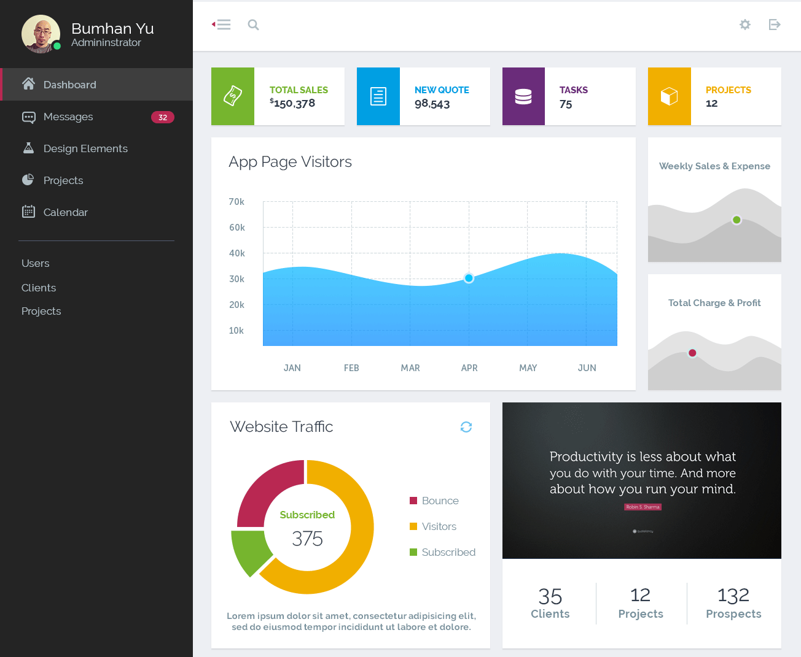
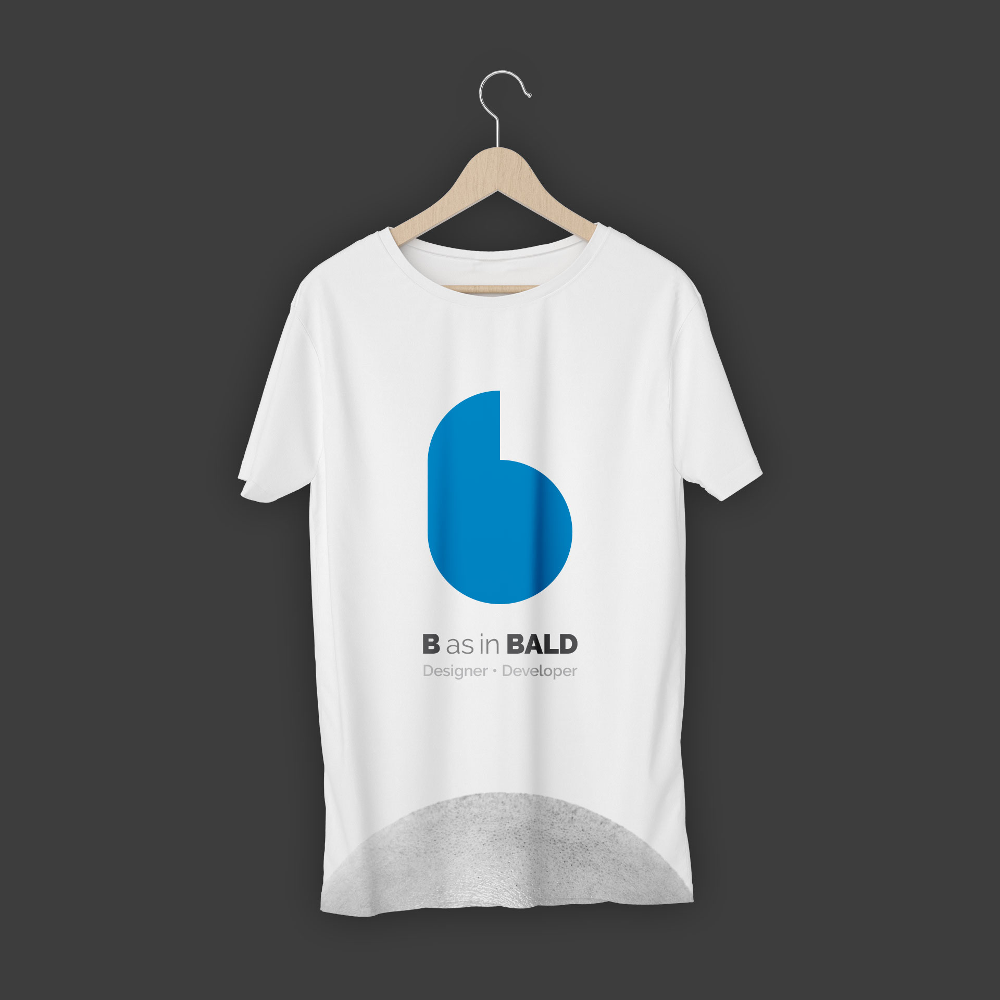
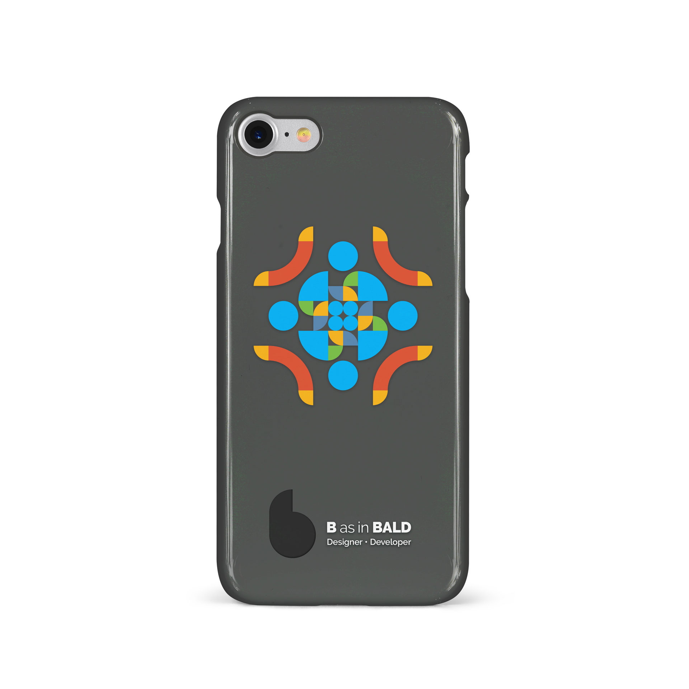
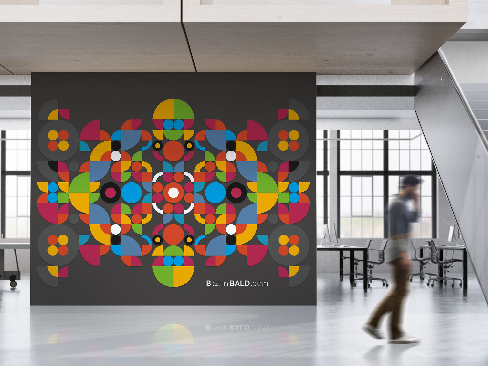
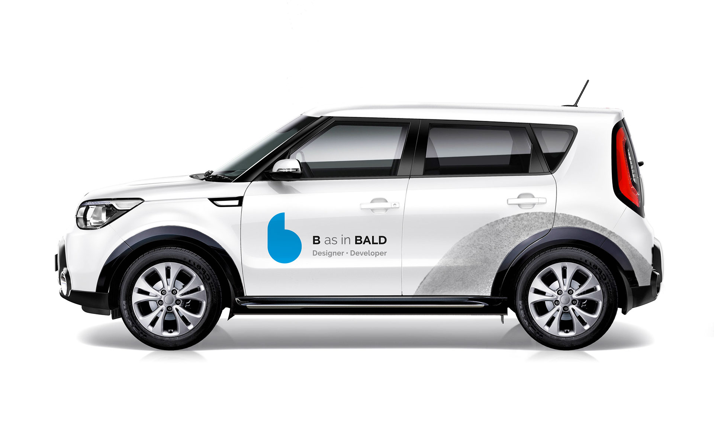
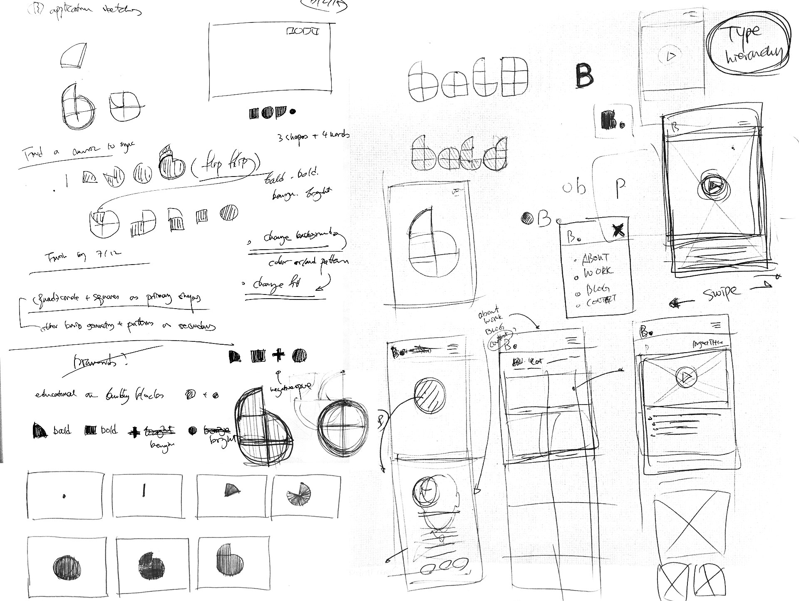

import { SimpleButton, ButtonContainer } from "../../components/SimpleButton";
import EmbedVideo from "../../components/EmbedVideo";

# Total visual communication system for creative consultation: identity system, responsive web hub, and blog

<section class="portfolioDetail">

### duties

concept development, design, develop

</section>

<section class="portfolioDetail">

### Challenge

Build a identity design system that captures the essence of multi-dimensionality

</section>

<section class="portfolioDetail">

### Solution

The immediate goal was two-fold: 1) to create a visual identity system with cross-platform versatility, and 2) to develop an online platform as a professional hub. As for point #1, I conceptualized around minimal geometry that can construct from simplest shapes to the most complicated fractal structures, which connotes my professional versatility. Once I designed a logotype out of basic geometry, a vibrant color palette and motion elements were applied. To translate the motion and flexibility to print, I created a series of abstract patterns using the same geometric element and printed on the back of business cards.

</section>

<section class="portfolioDetail">

### Dev Tools

`Gatsby/React`, `CSS-in-JS`, `MDX`

</section>

<ButtonContainer>
  <SimpleButton
    cta="GitHub Profile"
    link="https://github.com/baadaa/"
    color="var(--yellow500)"
  />
  <SimpleButton
    cta="GitHub Repo of this site"
    link="https://github.com/baadaa/b-as-in-bald/"
    color="var(--green500)"
  />
</ButtonContainer>

---

<EmbedVideo
  videoChannel="vimeo"
  aspectRatioPadding="56.34%"
  videoId="234397284"
/>

_Business card series: modular graphics based on the same geometry as the logo_

_Operations manager dashboard concept_

_Personal-branded shirt concept_

_Personal-branded phone case concept_

_Indoor oversize graphic concept_

_Vehicle wrap_

_Some of initial notes and sketches_

_Pattern graphics_
