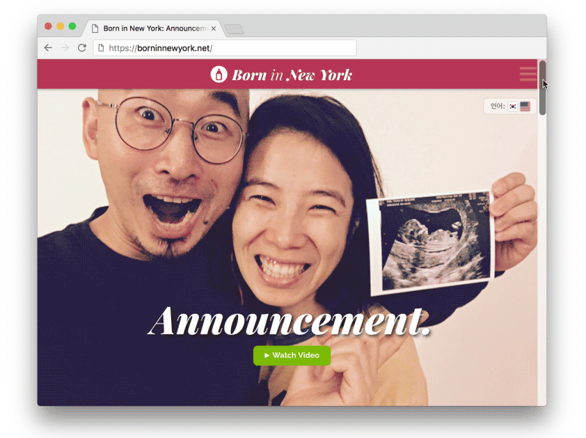
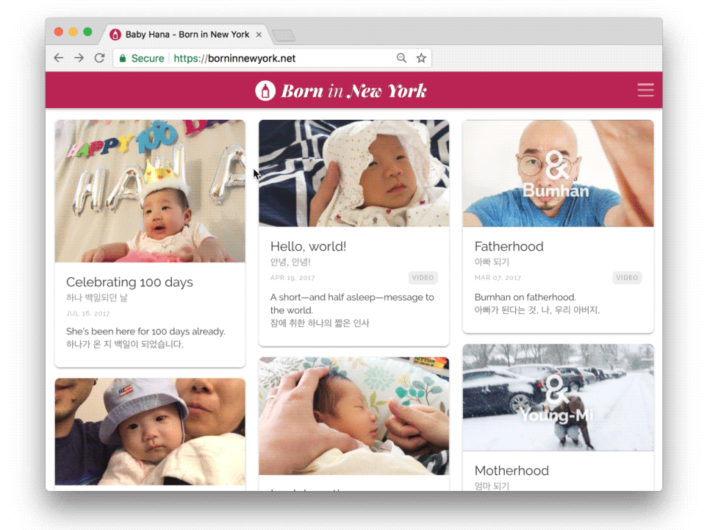

import { SimpleButton, ButtonContainer } from "../../components/SimpleButton";
import EmbedVideo from "../../components/EmbedVideo";

# Celebrating a newborn baby's life beginning, complete with her own logo, blog, photos, and interviews.

<section class="portfolioDetail">

### duties

design, develop, art direction, videography

</section>

<section class="portfolioDetail">

### context

During pregnancy, my wife and I have talked a lot about parenthood and childhood&mdash;sharing each other's childhood memories, how our parents raised us, and how _their_ parents raised them. Realizing that there wasn't much record of our upbringing other than random photos taken sporadically, we wanted to keep documenting our experience and growth as new parents as well as the life journey of our newborn.

</section>

<section class="portfolioDetail">

### Approach

The entire process expanded organically from naming exercise and logo design, to video-recording interviews, and to build a <small>Jekyll</small>-based blog platform. The first web element made public was [the baby announcement site](https://borninnewyork.net/announcement-2017/en/), which later became incorporated to the [main blog](https://borninnewyork.net/) site after Hana was born and her logo design completed. A dedicated [YouTube Playlist](https://www.youtube.com/playlist?list=PLCtFYoUrd_dDqhjPGje6U1m9cOdXxxwXG) as the video archive grows, and our parental introspections and Hana's growth milestones are continuously added to both the video channel and <small>Jekyll</small> blog.

</section>

<ButtonContainer>
  <SimpleButton
    cta="Launch Site"
    link="https://borninnewyork.net/"
    color="var(--green)"
  />
  <SimpleButton
    cta="View GitHub Repo"
    link="https://github.com/baadaa/born-in-new-york"
    color="var(--green)"
  />
</ButtonContainer>

---

_Hana's Logo_

<EmbedVideo
  aspectRatioPadding="53.4%"
  videoChannel="youtube"
  videoId="Cu4ZyeColoc"
/>

_Interview series: Young-Mi on Motherhood_

<EmbedVideo
  aspectRatioPadding="53.4%"
  videoChannel="youtube"
  videoId="d62ZWZirF5g"
/>

_Interview series: Bumhan on Fatherhood_

_Baby announcement site_

_Born in New York Blog_

<EmbedVideo
  aspectRatioPadding="53.4%"
  videoChannel="youtube"
  videoId="PSaQuMJvFNg"
/>

_Document video series: The Birth_
