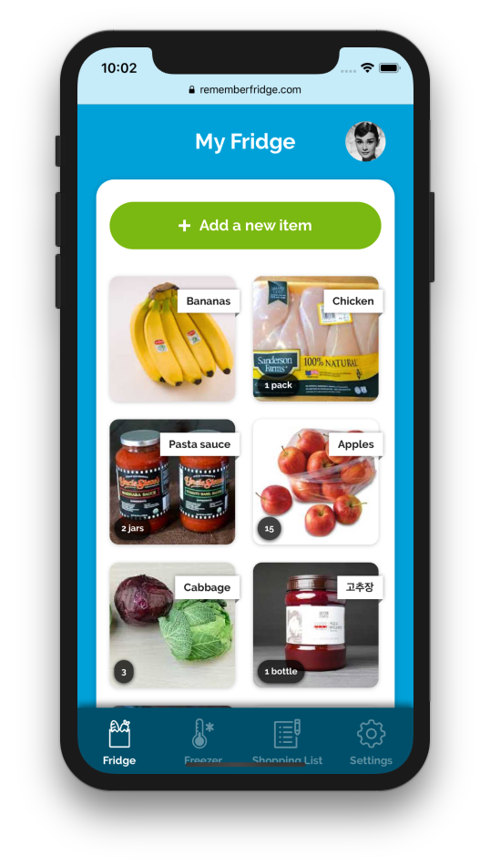
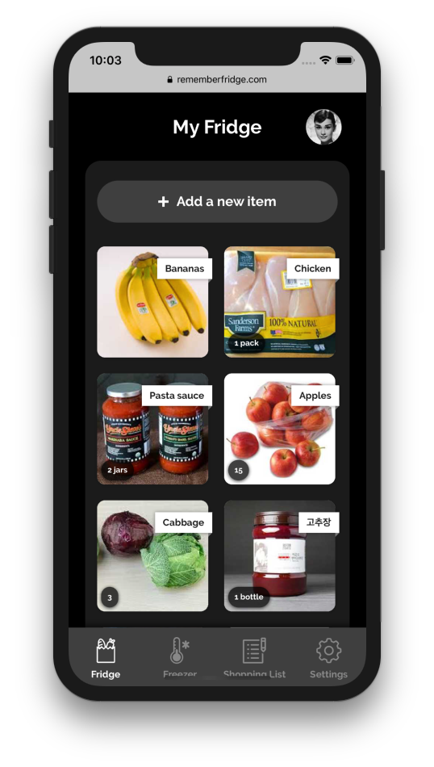
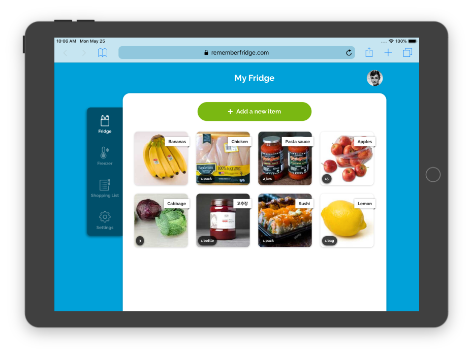
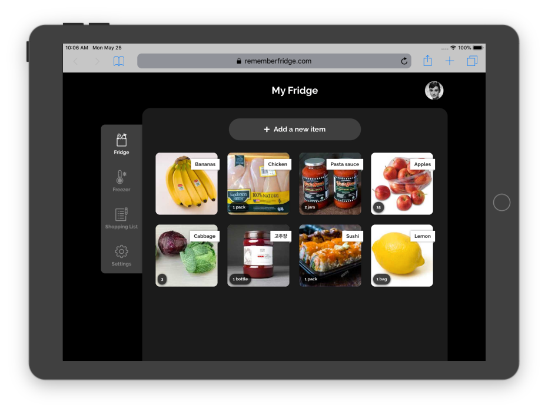
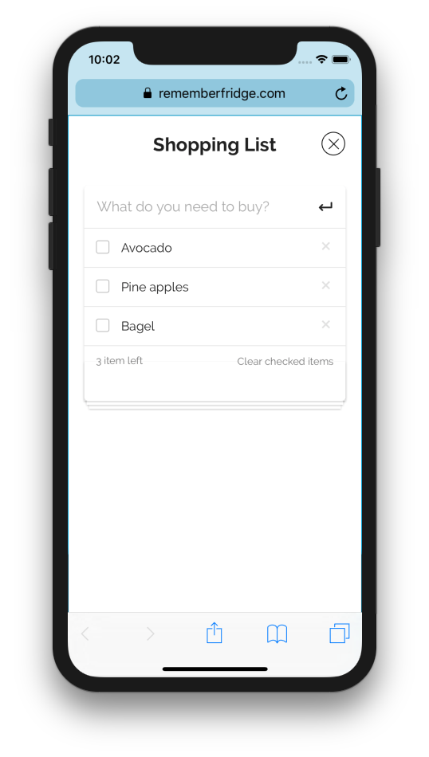
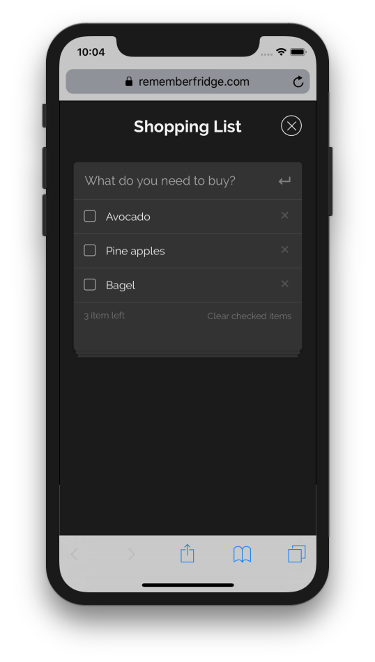
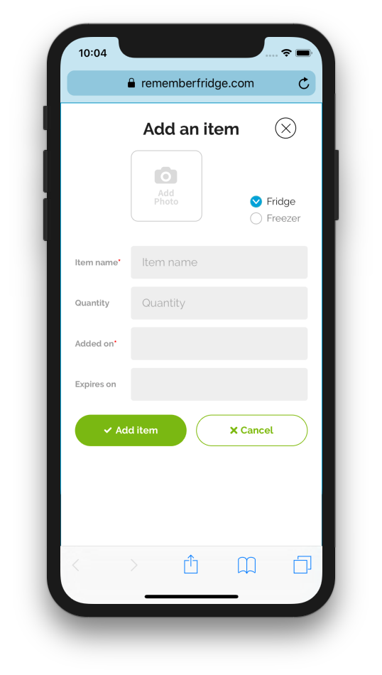
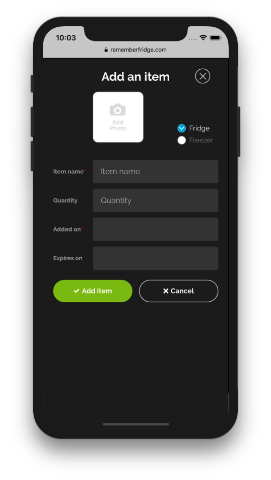

import { SimpleButton, ButtonContainer } from "../../components/SimpleButton";

<section class="portfolioDetail">

### client

DoubleVerify (internal tooling)

</section>

<section class="portfolioDetail">

### roles

Design, development

</section>

<section class="portfolioDetail">

### built with

`create-react-app`, `styled-components`

</section>

<section class="portfolioDetail">

### Background

Keeping track of what's in your fridge can be a hassle&mdash;_what's there, when you bought it, and when it goes bad_. This responsive web app is built to help minimize food waste and better manage fridge.

</section>

<section class="portfolioDetail">

### Key Features

- Manage food inventory by sections and track expiration dates

- Support dark color mode

- Use `localStorage` for data storage

- Manage shopping list

- Open source and free to use

</section>

<section class="portfolioDetail">

### TODO

- Use Firebase for cloud sync

- Add authentication

- Add food expiration warning

</section>

<ButtonContainer>
  <SimpleButton
    cta="Launch live demo"
    href="https://fridge.bald.design/"
    variant="yellow"
  />
  <SimpleButton
    cta="View GitHub Repo"
    href="https://github.com/baadaa/remember-fridge-react"
    variant="green"
  />
</ButtonContainer>

---

## Features

### Manage inventory

_Inventory view in light mode (smaller viewport)_

_Inventory view in dark mode (smaller viewport)_

_Inventory view in light mode (large viewport)_

_Inventory view in dark mode (large viewport)_

### Manage grocery list

An older iteration of [TODO MVC](https://todomvc.com/).

_Shopping list view in light mode (smaller viewport)_

_Shopping list view in dark mode (smaller viewport)_

### Add, edit, and remove items

_Editing view in light mode (smaller viewport)_

_Editing view in dark mode (smaller viewport)_

<ButtonContainer>
  <SimpleButton
    cta="Launch live demo"
    href="https://fridge.bald.design/"
    variant="yellow"
  />
  <SimpleButton
    cta="View GitHub Repo"
    href="https://github.com/baadaa/remember-fridge-react"
    variant="green"
  />
</ButtonContainer>
