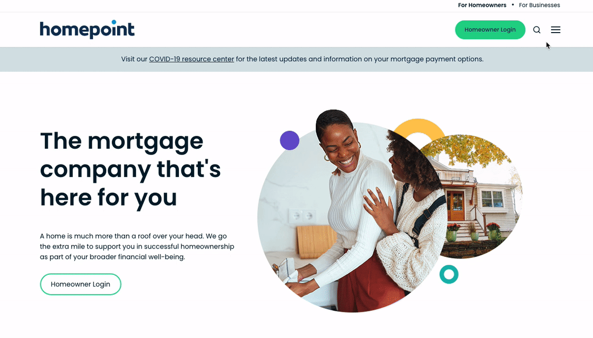
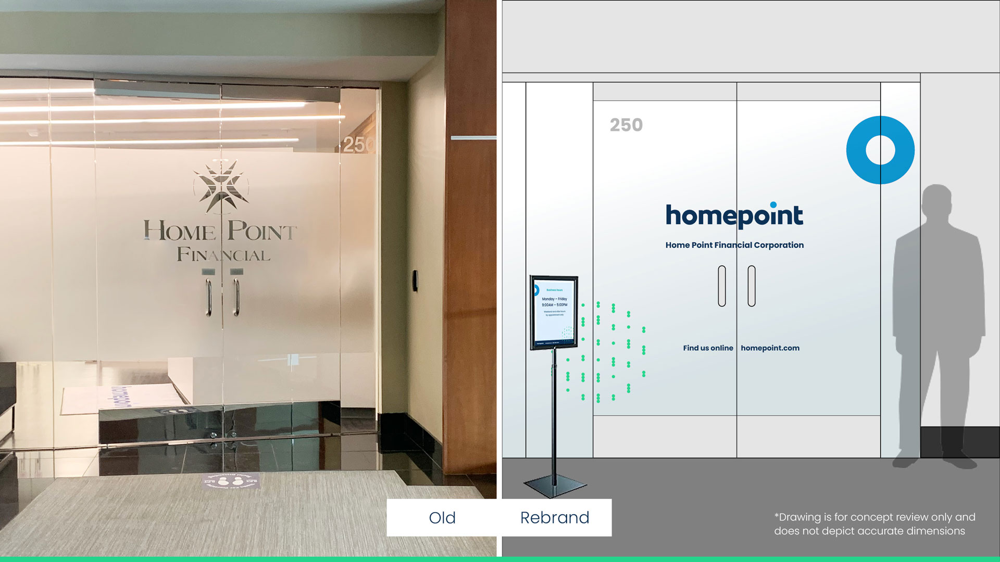
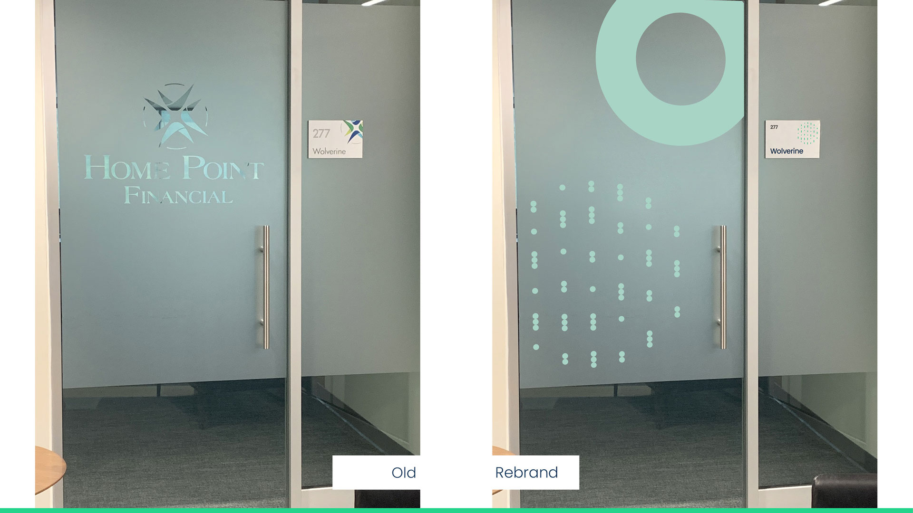
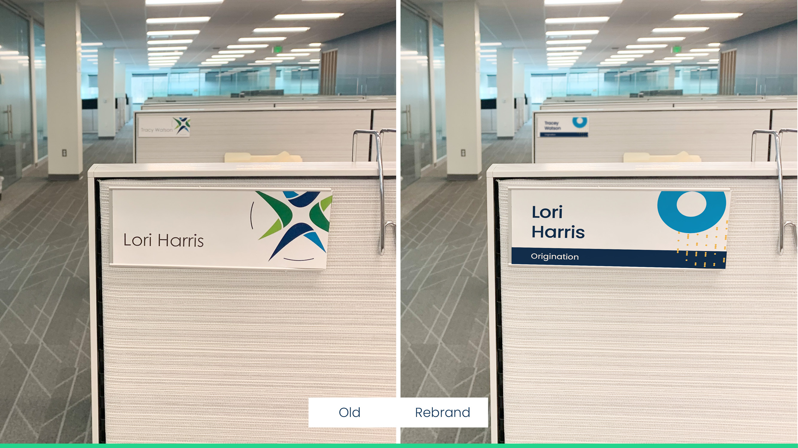
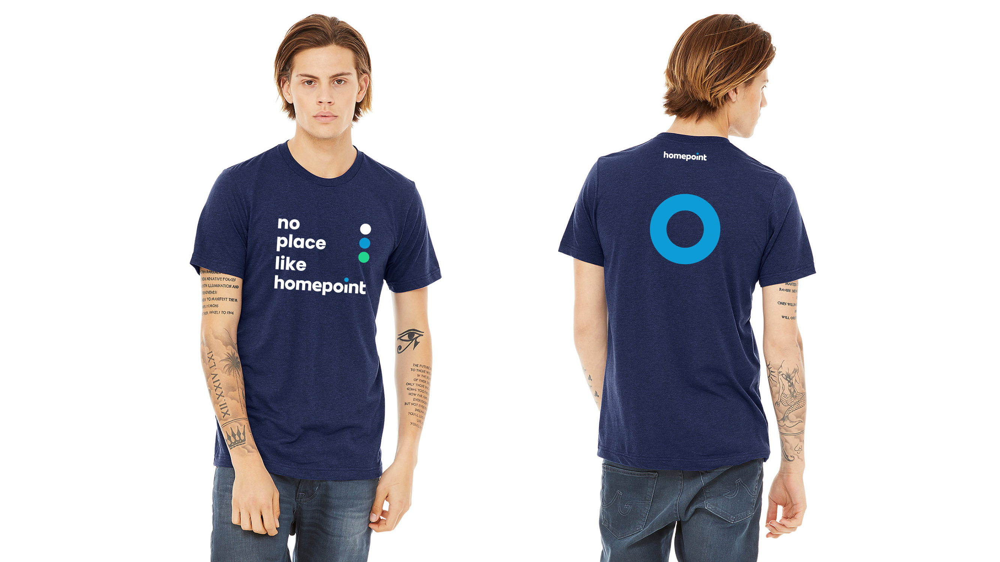
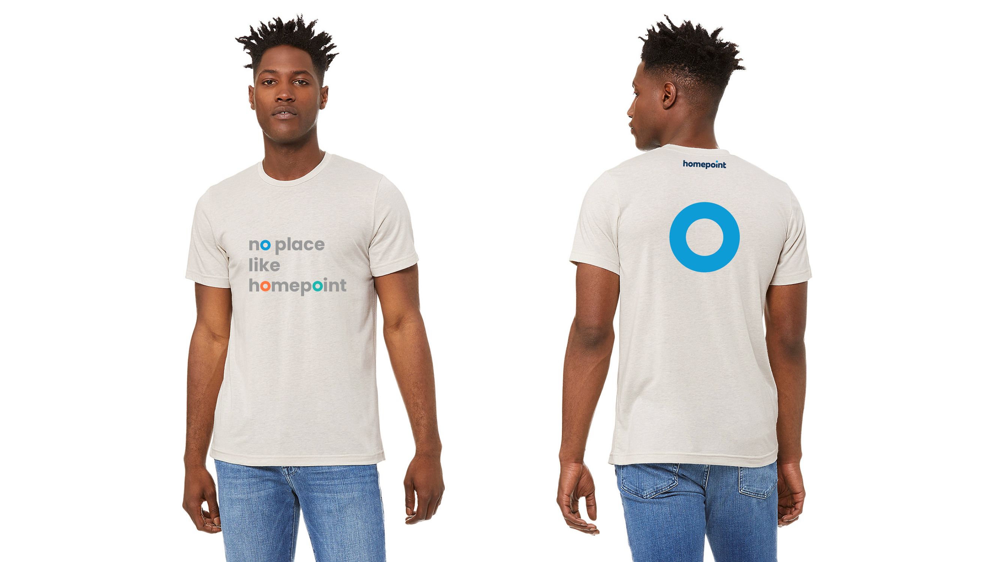
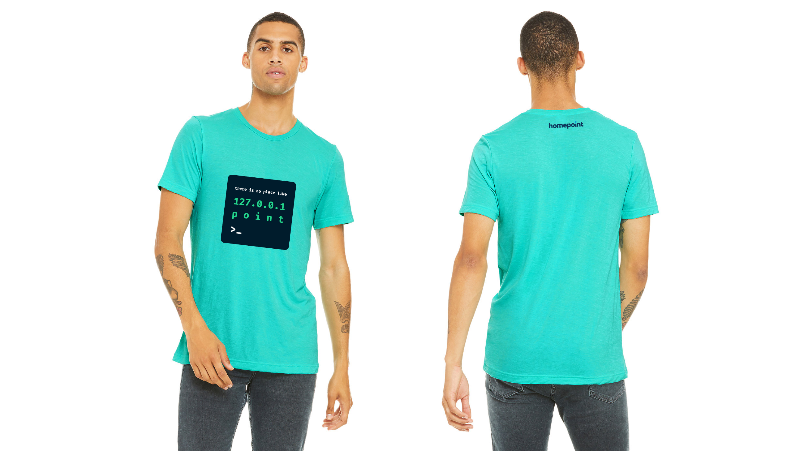
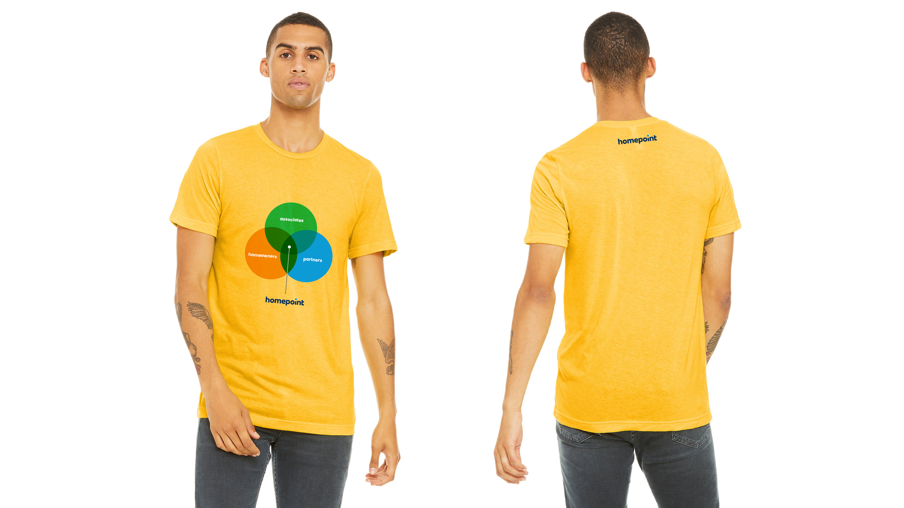

import HomepointLogoBlock from "../../components/Homepoint/HomepointLogoBlock";
import HomepointColors from "../../components/Homepoint/HomepointColors";
import HomepointBrandDeck from "../../components/Homepoint/HomepointBrandDeck";
import { InlineButton, ButtonContainer } from "../../components/SimpleButton";

NOTE: Content is in progress and incomplete.

<h6 style="padding:0;">
  Within 5 years since its inception as a local startup, Homepoint has become
  the third largest wholesale mortgage company in the nation. To support its
  continued growth and the stealth IPO efforts, Homepoint decided to refresh its
  brand presence and communication strategy.
</h6>

By the time I joined, external agencies had already been working on significant chunks of visual branding and marketing website projects. As a design director, I became responsible for further finalizing the identity development, creating a compelling verbal and visual brand narrative, and continously collaborating with all areas of the company—_product, engineering, marketing, legal, analytics, real estate, and more_—to keep improving the brand experience for customers.

<section class="portfolioDetail case">

### Roles

Brand strategy, design direction, UX/UI design, front-end engineering

</section>

<section class="portfolioDetail case">

### Agencies

- [1000 Watt](https://1000watt.net/work/homepoint/) <small>(Identity Design)</small>

- [Zeek](https://zeek.com//) <small>(Web development)</small>

</section>

---

## Brand strategy

Working closely with Chief Experience Officer, I helped define Homepoint's brand fundamentals and developed a strategic communication framework with verbal branding guidelines.

<HomepointBrandDeck />

_Brand strategy summary deck_

## Visual identity

### Logos

Based on the wordmark proposed by the agency, we tweaked small details and created a series of mark variations for parent and sister companies as well as a variety of digital applications.

<HomepointLogoBlock />

### Color palette

To highlight its energetic and approachable personality, we crafted a palette of vivid hues in high saturation. Also, each hue provides 10 levels of lightness tints to ensure proper contrast in any combination.

<InlineButton
  cta="Read more about the colors"
  href="/work/homepoint-colors"
  variant="gray"
/>

 
 

<HomepointColors />

### Website launch

Revealing the new brand identity, a redesigned website has also launched. Internally, I worked closely with stakeholders to understand their various needs and to assess the old website, and helped define a new sitemap and its UX structure. Externally, I collaborated tightly in front-end code base with the development agency and its project management needs. Post-launch, I ultimately took over the repo and have been maintaining the code.

<InlineButton
  cta="Read more about the site"
  href="/work/homepoint-website"
  variant="gray"
/>

 
 

_User segment toggle_

## Environmental graphics and swags

### Office interior

### Swags

## Digital design system

Insert `homepoint.design` elements here

## Product design

HOP, The Point, Launchpad elements here
