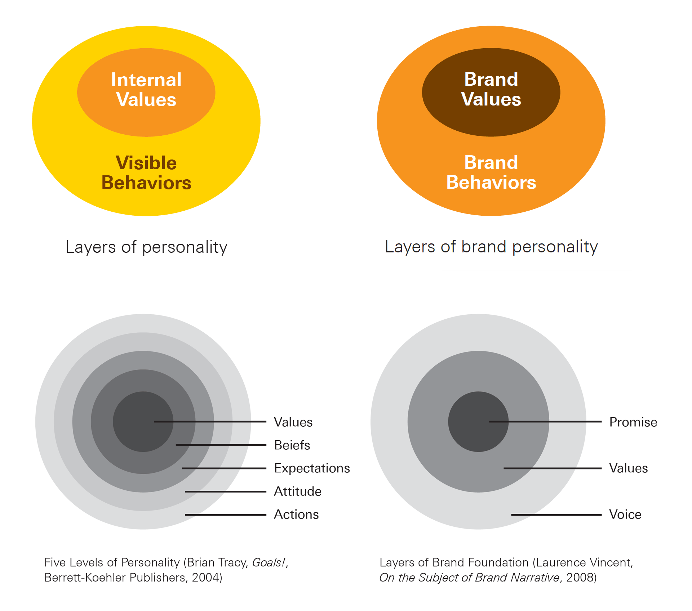
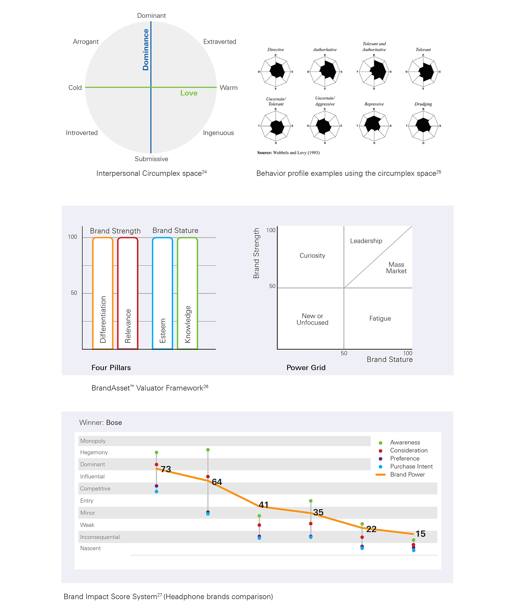
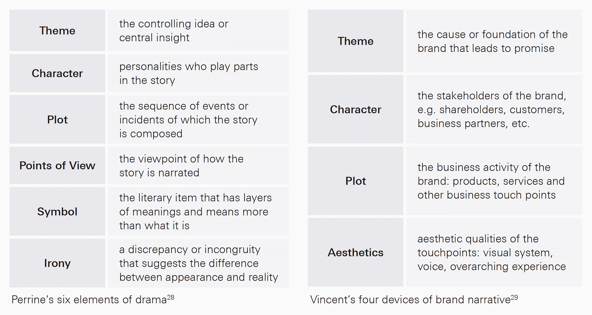
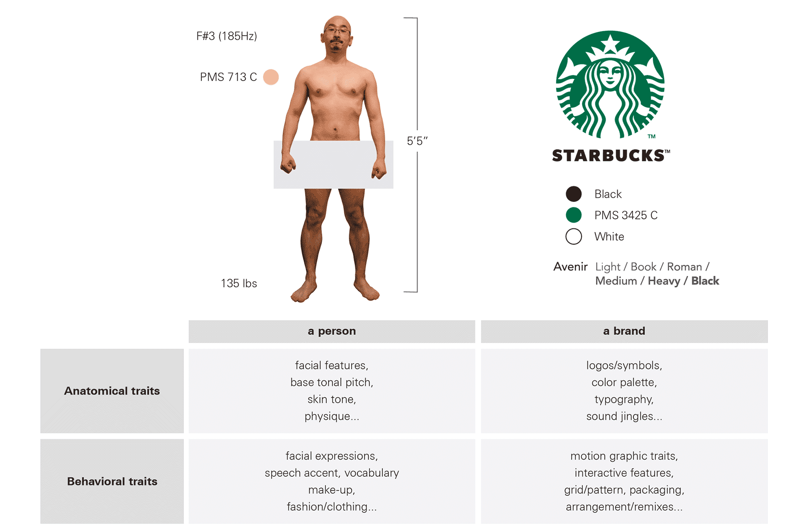
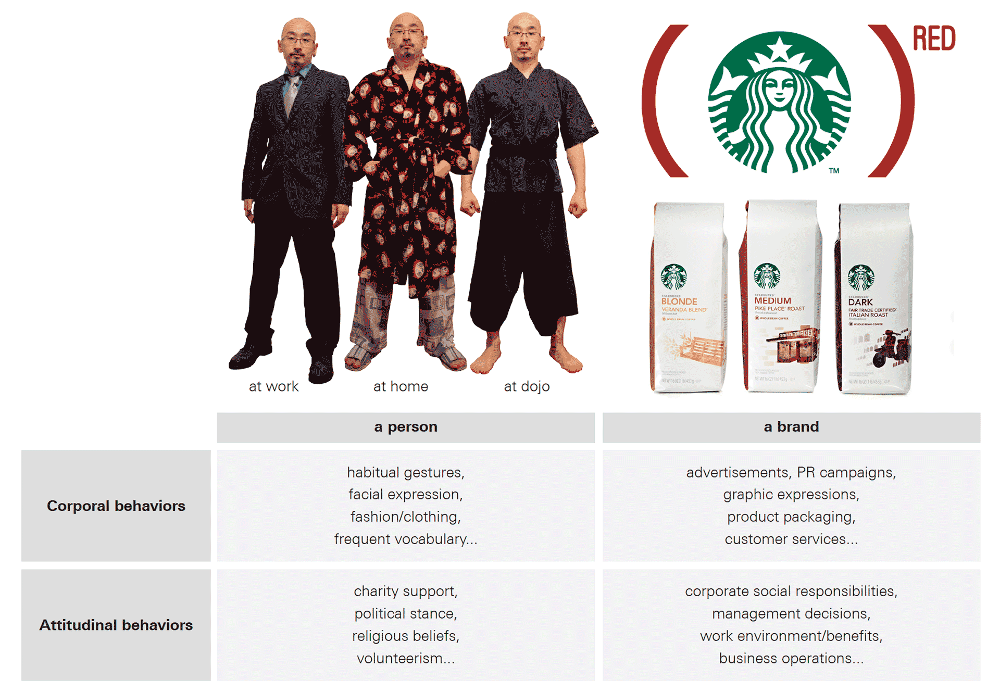
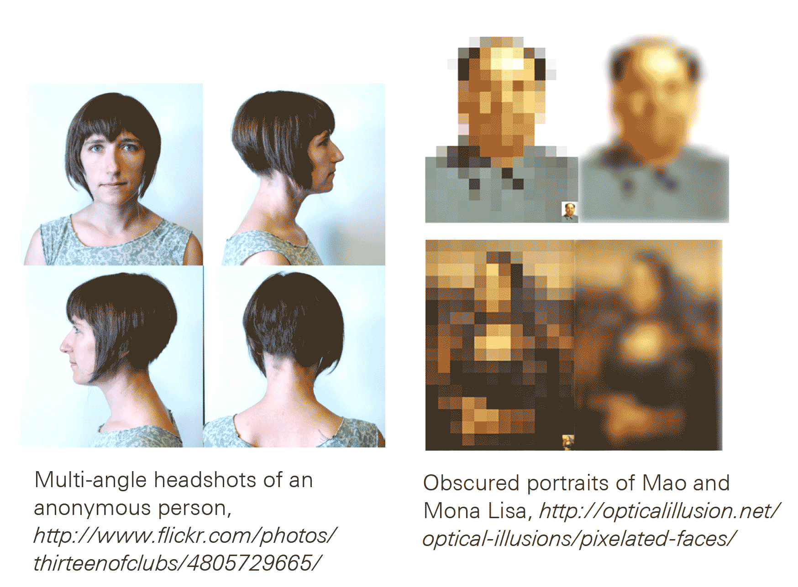
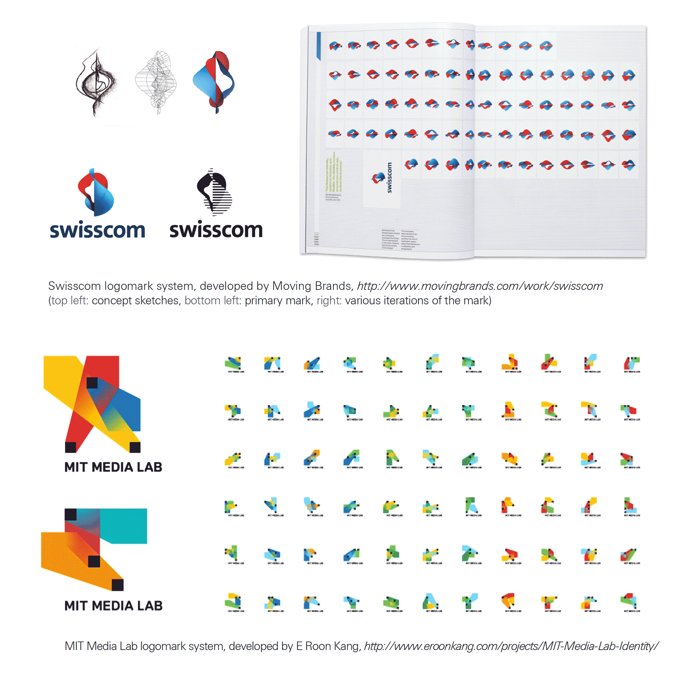
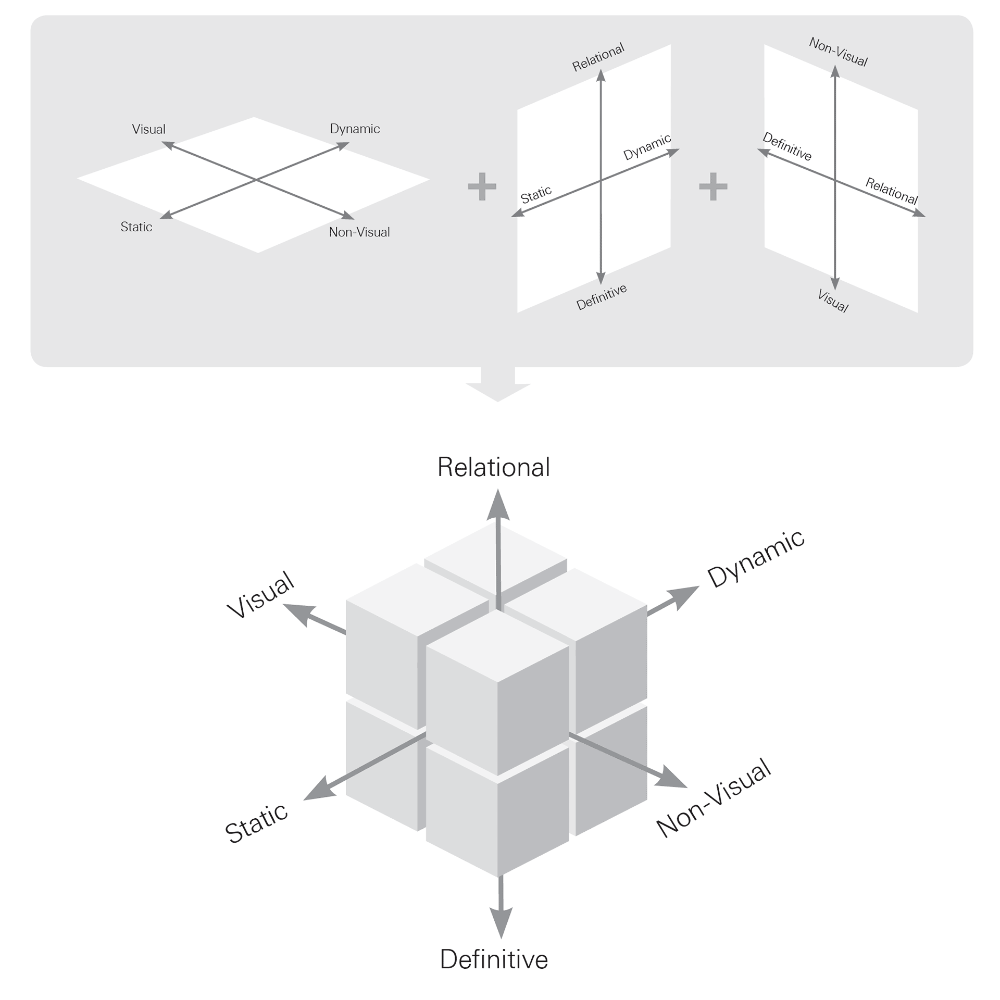
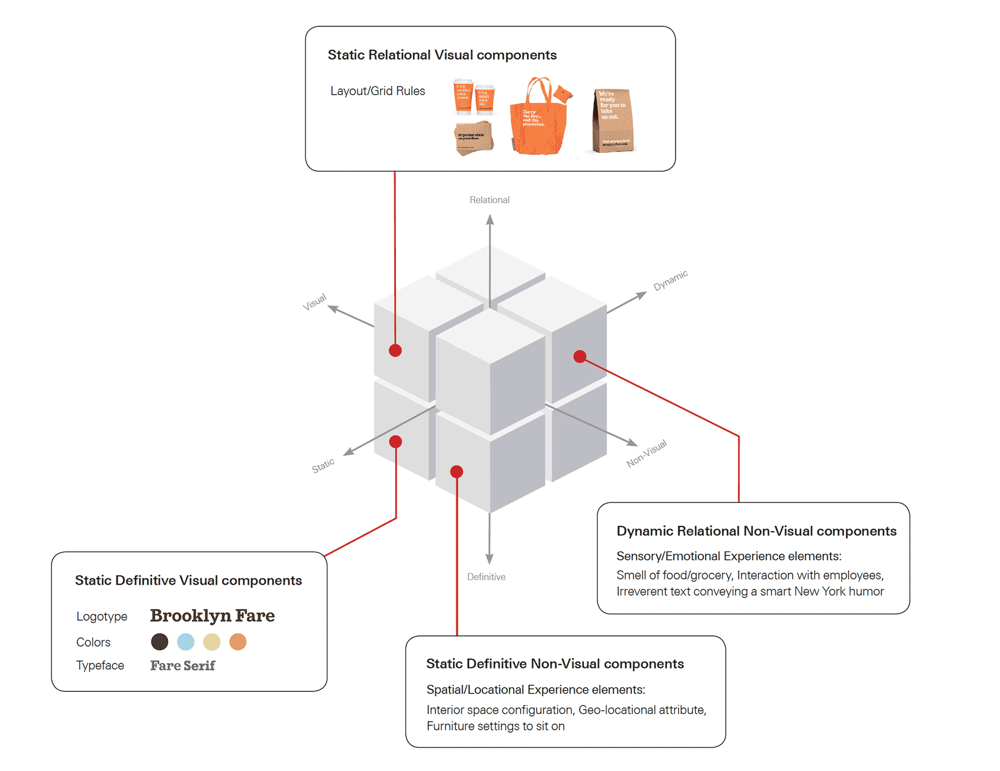

import { SimpleButton, ButtonContainer } from "../../components/SimpleButton";
import EmbedVideo from "../../components/EmbedVideo";

<EmbedVideo
  videoChannel="vimeo"
  aspectRatioPadding="56.34"
  videoId="65117847"
/>

<section class="portfolioDetail">

### roles

researcher, writer, designer

</section>

<section class="portfolioDetail">

### problem

Did you know there are over **217** breakfast cereal brands in the U.S. alone? With that many options, it's practically impossible for consumers to make a fully informed decision as to which brands are better than others and how. The more brands entering the market, the greater apathy among customer, the harder for brand entities to effectively differentiate themselves.

</section>

<section class="portfolioDetail">

### Insight

There are billions of people on earth, but humans somehow manage to identify their loved ones from complete strangers and build relationships. If you believe in [Dunbar's Number](https://en.wikipedia.org/wiki/Dunbar%27s_numbe), one's group of stable social relationships can be as large as 150 people. Suddenly, picking a cereal box out of 217 brands seems an easy task. Humans are apparently capable of detecting subtle differences from other humans, and making or breaking connections with them. How do we utilize the ability to communicate brands so that they can better connect with people?

</section>

<section class="portfolioDetail">

### Hypothesis

A brand is like a person; it has personal qualities, build relationships, and narrates its stories like a person does. Utilizing personality psychology theories, narrative frames and archetypes, and cognitive tools to measure behavioral patterns, we can better understand the dimensions of brand and thus better communicate them.

</section>

<ButtonContainer>
  <SimpleButton href="#" variant="yellow" cta="Download as PDF" />
  <SimpleButton
    href="http://www.blurb.com/b/4521259-make-friends"
    variant="green"
    cta="Purchase printed copy"
  />
</ButtonContainer>

---

_Brands as individuals: clear parallel between individuals and brands in how they form and express their qualities, i.e. personalities_

_Personality types and archetypes: examples of brands (left) and peple (right) in Hartwell and Chen's brand archetype framework._

_Brands in interpersonal relationships: we could assume that brand-customer relationship development will be similar to that of person-to-person relationship._

_Brands as narratives: in any story there are characters, each with different personality. Put a brand in place of one of the characters, then we have a narrative setting._

_Comparative example of fundamental anatomy and behavior traits of a person and a brand._

_Comparative example of corporal and attitudinal behaviors of a person and a brand._

_Brands as patterns: humans have sophisticated cognitive capability to decode complex or/and fragmented stimuli to reconstruct original form._

_Brands as patterns: examples of logomark system that take advantage of pattern recognition, which don't rely on a single monolithic brand mark._

_Axes of brand behavior: how brands behave in public along multiple corporal axes._

_Axes of brand behavior: an example of triaxial diagram to illustrate the corporal behavior elements Brooklyn Fare exhibits through various channels._
