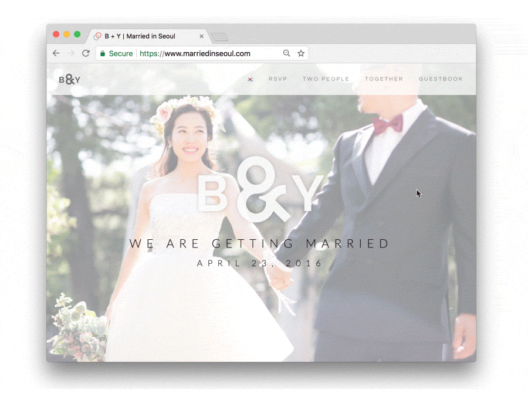
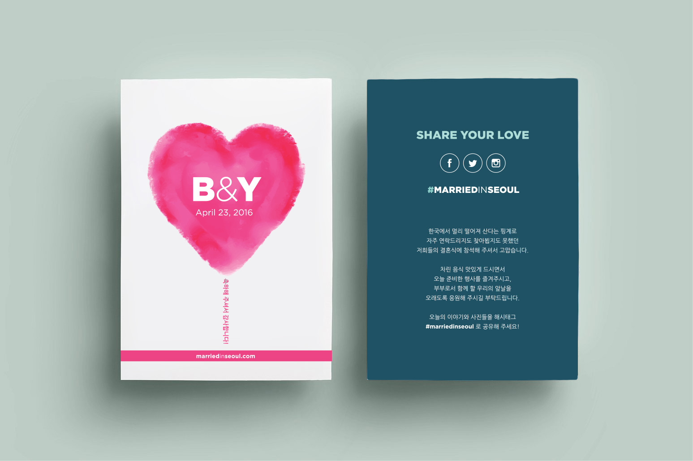
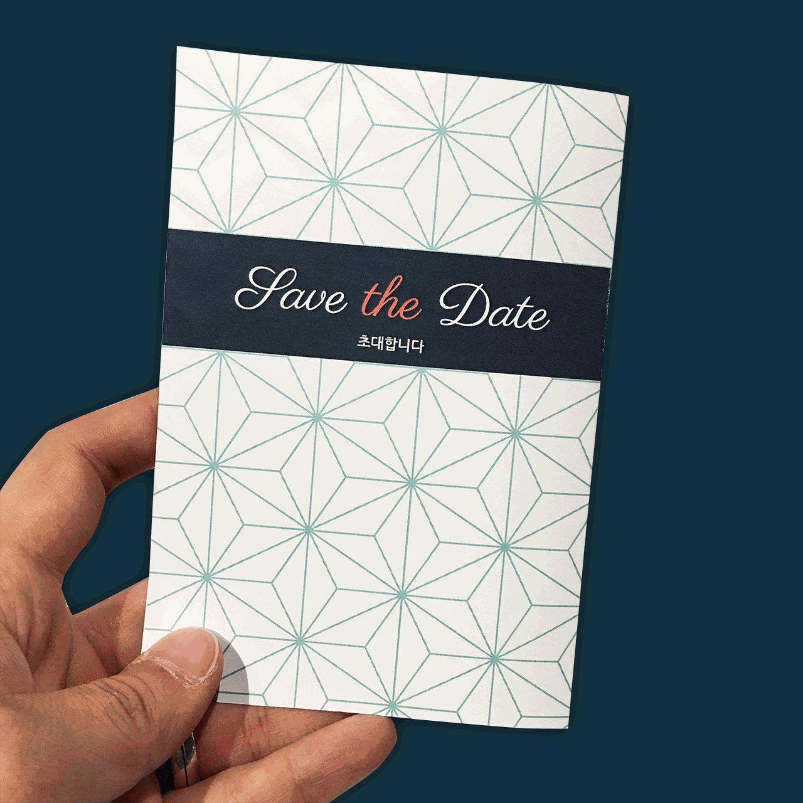
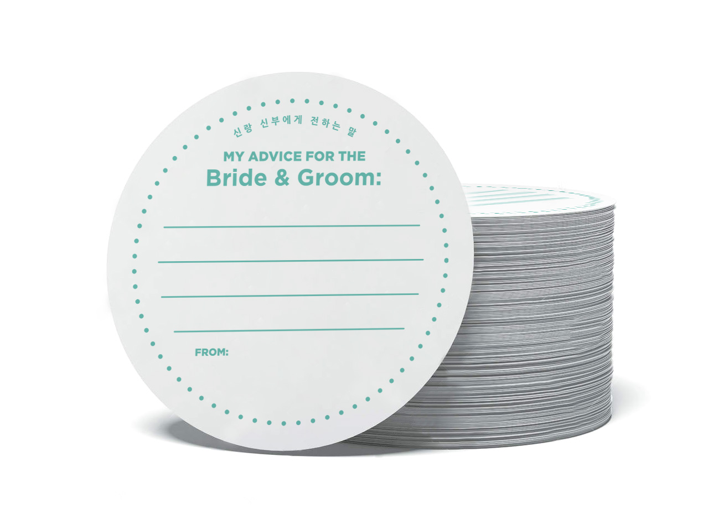

import { SimpleButton, ButtonContainer } from "../../components/SimpleButton";
import EmbedVideo from "../../components/EmbedVideo";

<section class="portfolioDetail">

### Roles

designer/developer (print, motion, interactive), writing, bridegroom

</section>

<section class="portfolioDetail">

### Challenge

The wedding was scheduled to take place in Seoul where our families are, but all the planning and preparation had to be done remotely in New York where we live—while busy working full-time. Knowing nothing about the venue our parents helped reserve, we had to work only from floor plan and a few photographs for planning. Certain materials needed to be bilingual, since we had two groups of audience—Americans who don't speak Korean and Koreans who don't speak English. Aside from designing and planning for the event, another real challenge was to find a reliable vendor to produce the materials locally in Seoul.

</section>

<section class="portfolioDetail">

### Solution

I gathered as much information as possible of the space and its equipment settings through myriads of emails and phone calls over the time zones. While designing print materials and the event itself per given parameters, I focused on creating the central bilingual website as a visual and interactive narrative. The idea was to present the stories of two very different individuals and how they converge into bigger story in visually compelling and engaging format—inviting visitors to celebrate not only the wedding event but also the lives of two people, by getting to know them more.

</section>

<section class="portfolioDetail">

### Materials

- **Website**: Taking advantage of readily available <small>WordPress</small> plugins, I built a visual essay with <small>RSVP</small> and guestbook weaved into it—which I later turned into a static <small>HTML/CSS</small> site for better performance.

- **Video Greetings**: We compiled a reel of video greetings from our New York friends, and screened at the wedding in Seoul. While none from our New York circle could come to Seoul, they could virtually be a part of the event, and for the Korean guest who knew nothing about our New York life could take a glimpse into what we've built in America.

- **Serenade and Vow**: Commemorating the days together, I collected and curated hundreds of photos and videos taken since we had first met, and created a collage video piece. With a musical instrumental track mixed in, the reel served as a backdrop as we said wedding vows and I serenaded for the bride.

- **Printed Objects**: <em>Wedding invitation</em> was printed in Seoul and mailed in advance. <em>Coasters</em> and <em>pens</em>, designed for guests to write messages for newly-weds, were produced in the U.S. and placed on each seat before the ceremony. <em>Postcards</em> were also printed in the U.S. and placed at the reception desk, so each guest could take one.

</section>

<ButtonContainer>
  <SimpleButton
    cta="Launch live site"
    href="https://www.marriedinseoul.com/"
    variant="yellow"
  />
  <SimpleButton
    cta="GitHub Repo of this site"
    href="https://github.com/baadaa/married-in-seoul/"
    variant="green"
  />
</ButtonContainer>

---

_Logo for the newly married couple_

_Intro section of the home page_

_Welcome flyers placed at reception table_

_Wedding invitation mockup_

_Coasters for guests to write messages on_

<EmbedVideo videoChannel="vimeo" videoId="163962331" />

_Shout-outs from New York video (edited at 4:3 ratio per venue screening requirements)_

<EmbedVideo videoChannel="vimeo" videoId="163962316" />

_Marriage vow and serenade for bride video (edited at 4:3 ratio per venue screening requirements)_
