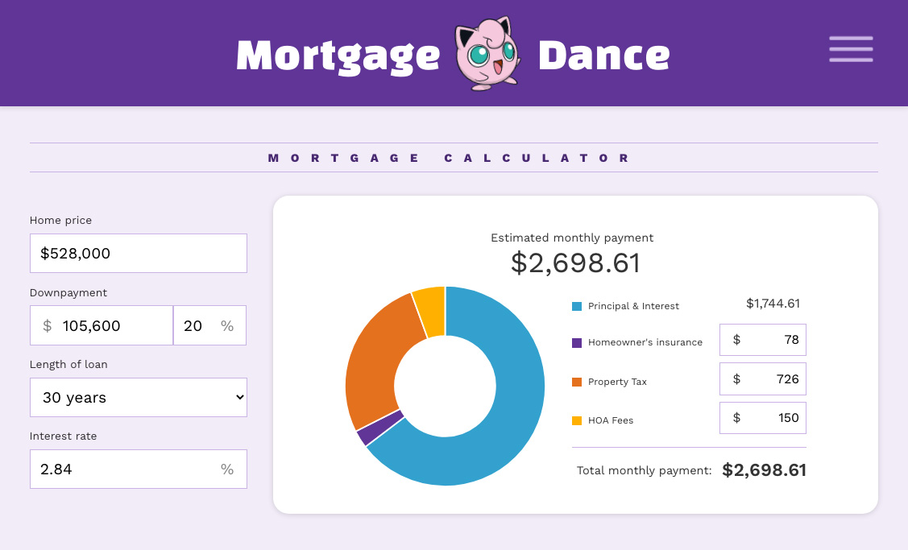
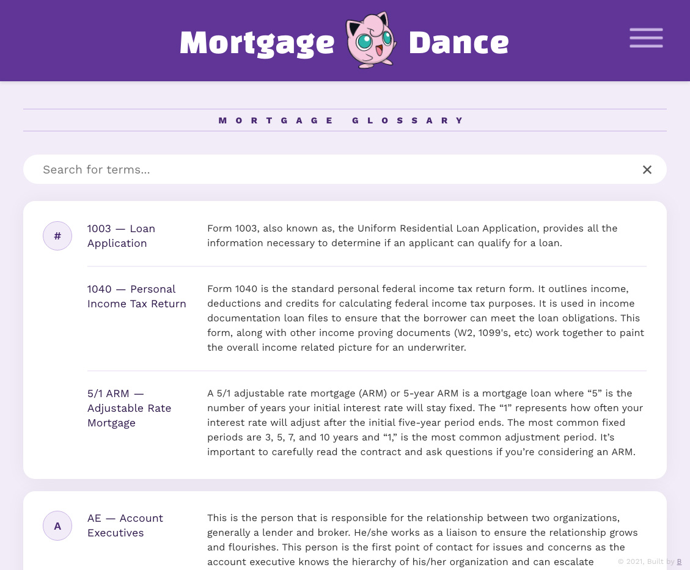
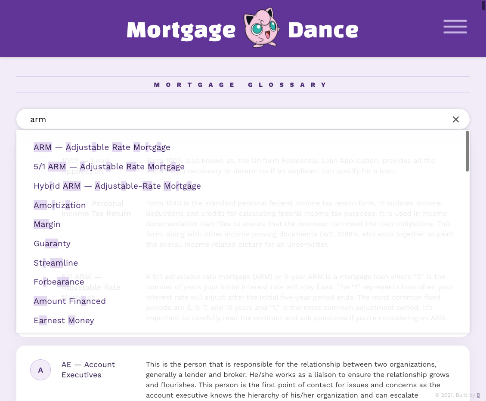
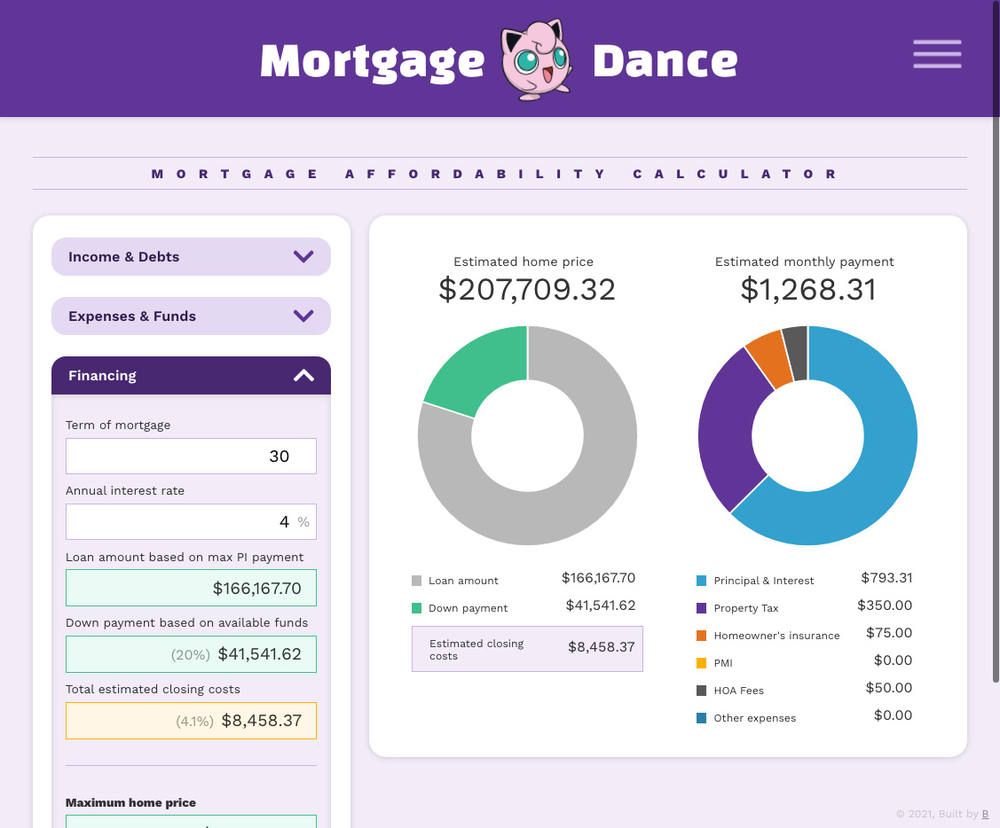
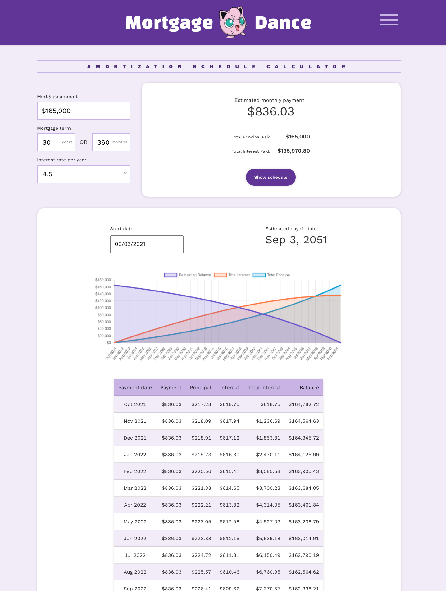

import { SimpleButton, ButtonContainer } from "../../components/SimpleButton";

<section class="portfolioDetail">

### client

Self-initiated, open source

</section>

<section class="portfolioDetail">

### roles

Design, development

</section>

<section class="portfolioDetail">

### built with

`React`, `Gatsby`, `Dinero.js`, `Chart.js`, `Fuse.js`

</section>

<section class="portfolioDetail">

### Background

Mortgage is complicated and full of unfamiliar concepts. While there are plenty of resources online—_e.g. calculators, articles, glossaries, videos_—I couldn't yet find a beginner-friendly and ad-free collection, so I decided to build one.

</section>

<section class="portfolioDetail">

### Key Features

- Mortgage glossary with fuzzy search

- A variety of mortgage calculators with visual charts
  - Basic mortgage calculator
  - Affordability calculator
  - Amortization schedule calculator

</section>

<section class="portfolioDetail">

### TODO

- Create "Mortgage fundamentals" visual content as a resource

- Add other useful calculator modules

- Edit glossary entries

- Expand "Additional resources"

</section>

<ButtonContainer>
  <SimpleButton
    cta="Launch live site"
    href="https://mortgage.dance/"
    variant="yellow"
  />
  <SimpleButton
    cta="View GitHub Repo"
    href="https://github.com/baadaa/mortgage-dance"
    variant="green"
  />
</ButtonContainer>

---

## Visual snapshots

### Mortgage calculator

_Dynamic calculation of basic inputs: largely based on https://www.bankrate.com/calculators/mortgages/mortgage-calculator.aspx_

### Mortgage glossary

_Mortgage Glossary: terms and definitions collected from multiple online sources_

_Mortgage Glossary: fuzzy search powered by Fuse.js_

### Affordability calculator

_Calculating affordability based on multiple factors: largely based on https://www.vertex42.com/Calculators/home-affordability-calculator.html_

### Amortization schedule calculator

_Calculating amortization schedule based on basic inputs: largely based on https://www.bankrate.com/calculators/mortgages/amortization-calculator.aspx_

<ButtonContainer>
  <SimpleButton
    cta="Launch live site"
    href="https://mortgage.dance/"
    variant="yellow"
  />
  <SimpleButton
    cta="View GitHub Repo"
    href="https://github.com/baadaa/mortgage-dance"
    variant="green"
  />
</ButtonContainer>
