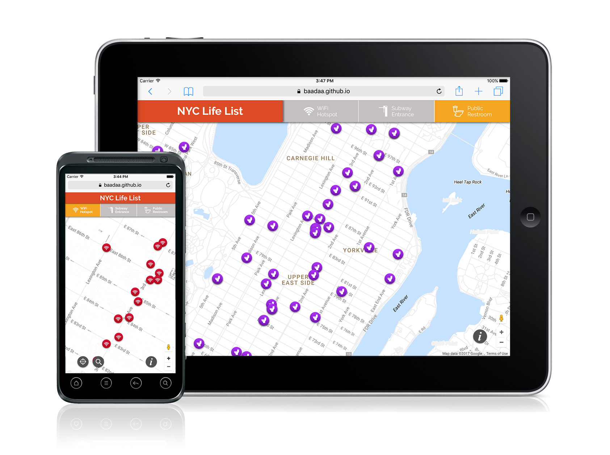
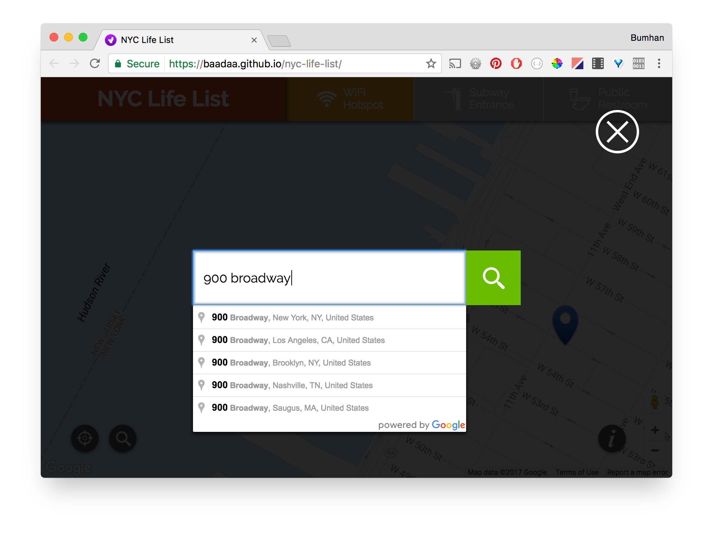
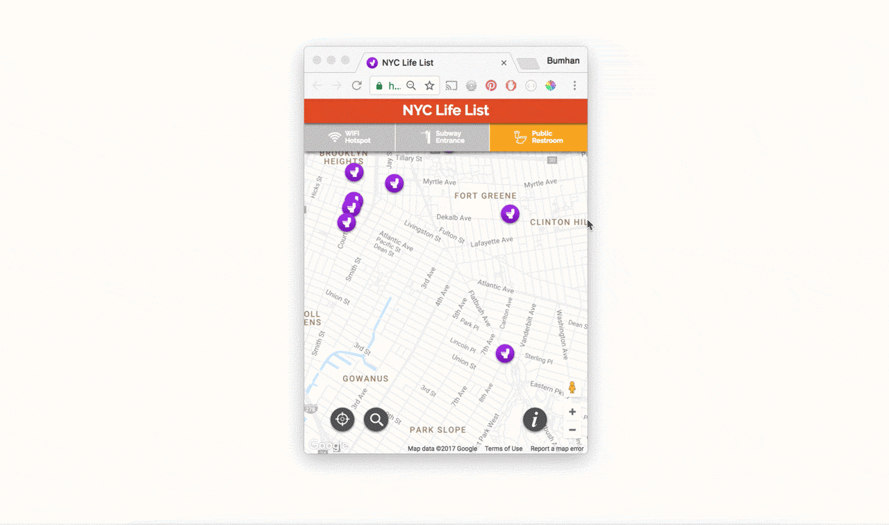

import { SimpleButton, ButtonContainer } from "../../components/SimpleButton";

<section class="portfolioDetail">

### roles

Designer, developer

</section>

<section class="portfolioDetail">

### tools

`JS`, `HTML/CSS`, Google Maps API, NYC Open Data API, Geocod.io, csvjson.com

</section>

<section class="portfolioDetail">

### Challenge

Living and working in New York city means spending quite some time on the streets, and there are three most needed elements in New York street life that just can't be found when we desperately need them: Wifi hotspots, subway entrances, and restrooms.

</section>

<section class="portfolioDetail">

### Solution

This responsive web app finds the nearest access you have, whether it's subway entrance, WiFi signal, or a public restroom that you need. Taking advantage of [NYC Open Data](https://opendata.cityofnewyork.us/) and a handful of NYC restroom datasets available online ([here](http://www.toiletfinder.com/), [here](http://diaroogle.com/toilets), and [here](http://m3.mappler.net/nyrestroom/)), I mapped out each geolocation details. Users can simply drag the map and click each icon, or search location by address or/and zip code.

</section>

<section class="portfolioDetail">

### Dev notes

For smoother user experience and reduce server requests, each API call response is stored at `localStorage`, which ensures to minimize unnecessary API calls and thus faster response to user actions. Practical usage could be limited by how actively the data feed is maintained.

</section>
<ButtonContainer>
  <SimpleButton cta="Launch Live App" link="https://baadaa.github.io/nyc-life-list/" color="var(--yellow500)" />
  <SimpleButton cta="View GitHub Repo" link="https://github.com/baadaa/NYC-Life-List" color="var(--green500)" />
</ButtonContainer>

---

