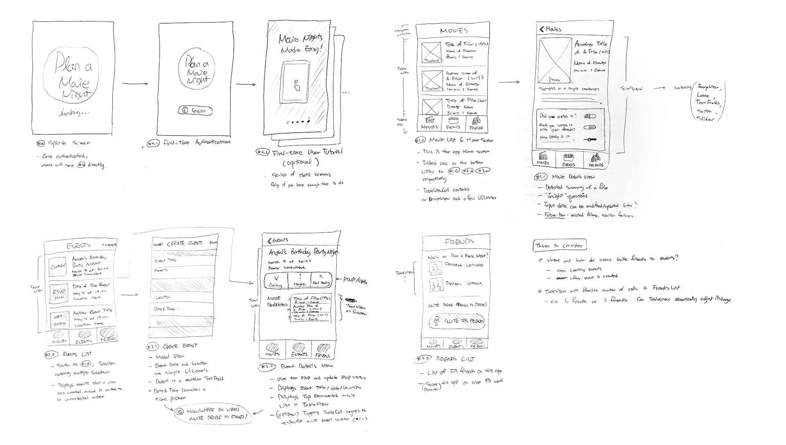
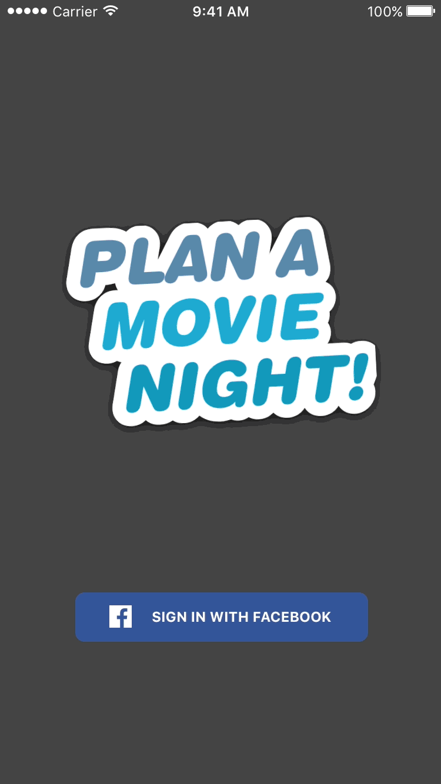
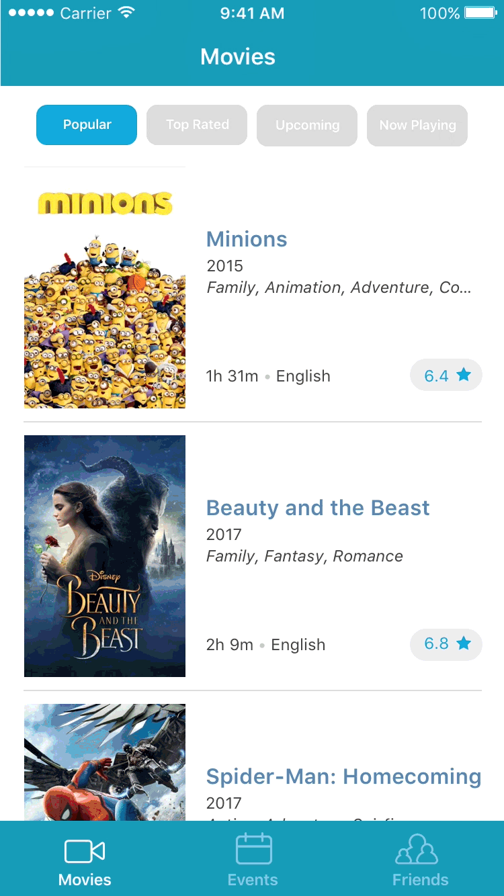
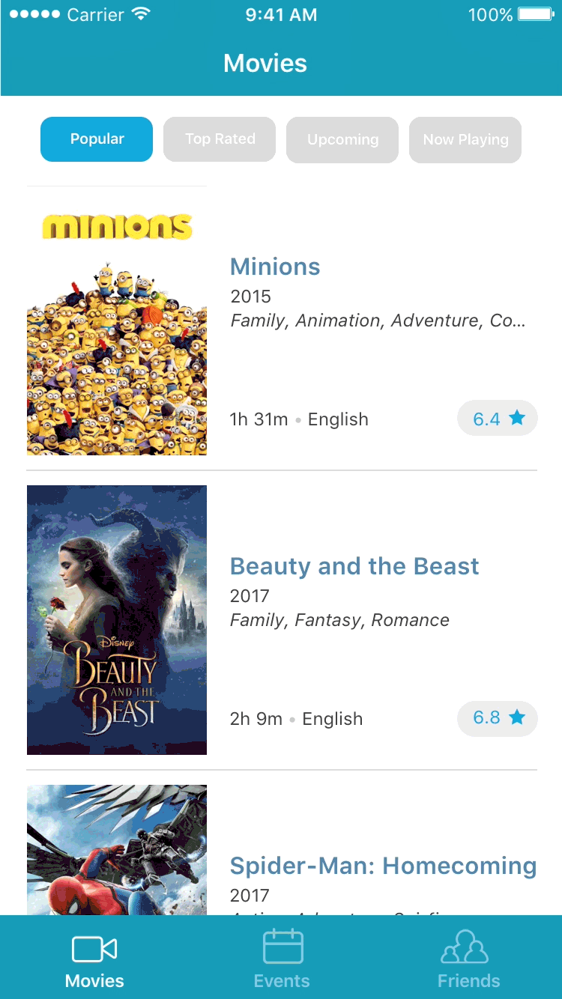
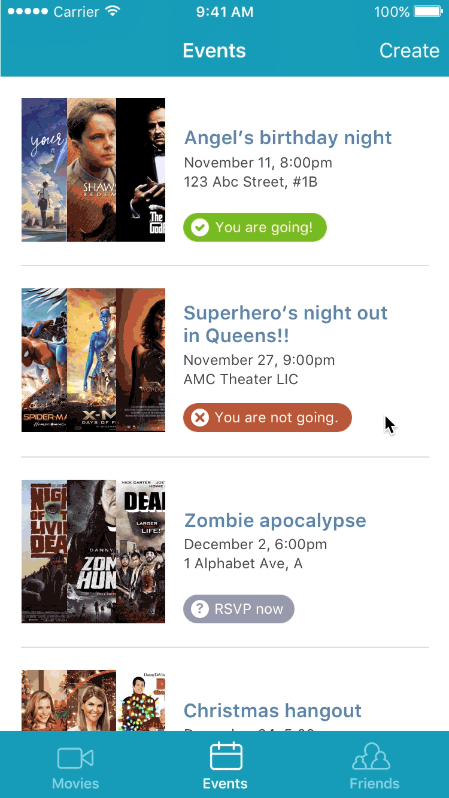

import { SimpleButton, ButtonContainer } from "../../components/SimpleButton";

<section class="portfolioDetail">

### roles

UX/visual designer, front-end developer _(<small>VIEW</small> component of MVC pattern)_

</section>

<section class="portfolioDetail">

### language

`SWIFT`

</section>

<section class="portfolioDetail">

### Challenge

When organizing a movie night with friends, choosing the film to watch together can be a painful process. The larger the group, the harder to select the perfect movie that _everybody_ would enjoy watching. How do you make it easy to gather friends, pick time and place, and most importantly, select the perfect film to screen?

</section>

<section class="portfolioDetail">

### Solution

The main idea was to devise an impeccable recommendation engine, which will collect users' preferences and insights on a variety of films and present the perfect selections for a movie night by cross-analyzing participants' taste database. Users can browse a huge list of movies provided through <small>[TheMovieDB API](https://www.themoviedb.org/)</small>, and choose to leave quick insights on each film: <small>1) did you watch this film? 2) would you watch it with your friends? 3) how bad do you want to watch it?</small> When it's time for gathering, users can simply create an event by choosing the date and time, connected via Facebook Event, and inviting friends&mdash;and the app will take care of the rest by recommending the impeccable film to watch together.

</section>

<section class="portfolioDetail">

### Execution

A four-people team divided roles per MVC pattern: <small>MODEL</small>, <small>VIEW</small>, and <small>CONTROLLER</small>. **My responsibility was** to design and build the <small>**VIEW**</small> component&mdash;that is, to 1) architect the user experience, 2) design user interface and layout, and 3) ultimately program the front-end view of the application using iOS native <small>SWIFT</small>. The other members would separately develop <small>MODEL</small> and <small>CONTROLLER</small> components that handle recommendation engine and other back-end functionality, and plug them into the front-end <small>VIEW</small>.

</section>

<section class="portfolioDetail">

### Limitation:

Three-week sprint resulted in functional front-end shell of the app, but the complete app never got to come to fruition. Although <small>API</small> integration was well on its way with Facebook and <small>TMDb</small>, the core recommendation engine development came to a halt as the responsible team members got pulled into other engagements.

</section>

<ButtonContainer>
  <SimpleButton
    cta="Download initial UX draft"
    href="testlink"
    variant="yellow"
  />
  <SimpleButton
    cta="View GitHub Repo"
    href="https://github.com/baadaa/plan-a-movie-night"
    variant="green"
  />
</ButtonContainer>

---

_Initial UX hand-sketches_

_Key screens at a glance_

_Login with Facebook_

_Browsing various movie sections_

_Viewing movie details and entering insight_

_Browsing events and RSVPing_

