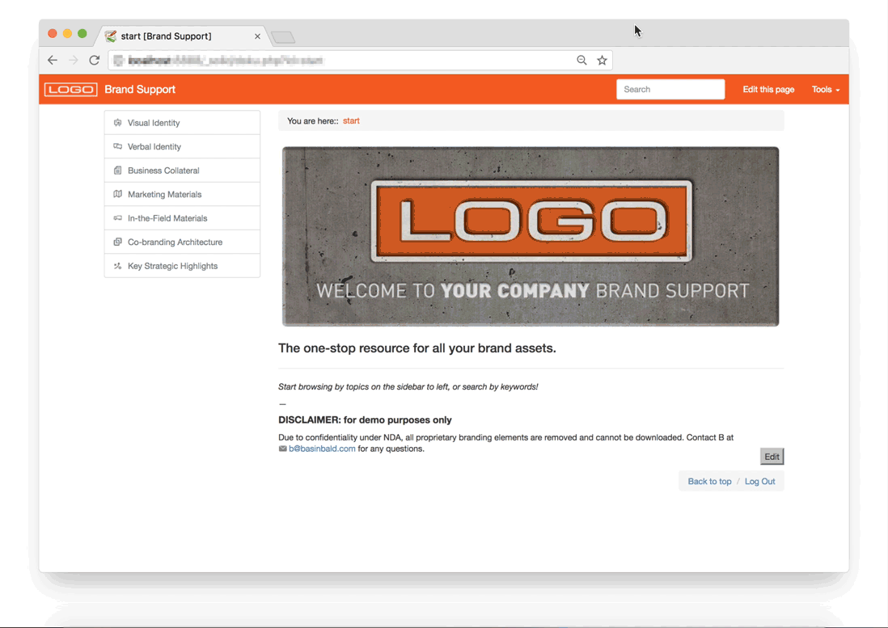
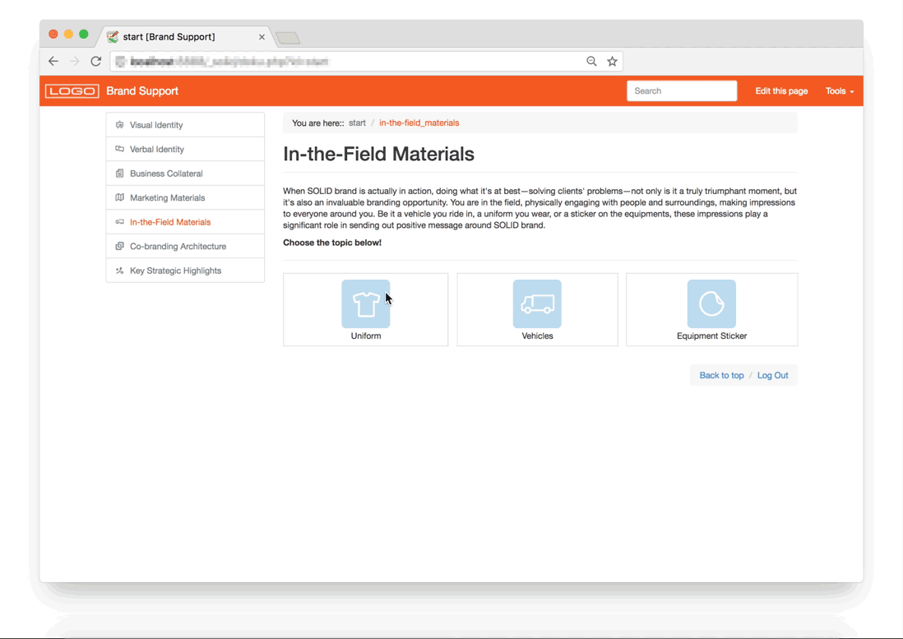

# Comprehensive wiki website that helps clients easily and effectively manage their brand assets for impeccable brand communication—replacing bulky brand guideline books

<section class="portfolioDetail">

### agency

[The Moderns](https://themoderns.com)

</section>

<section class="portfolioDetail">

### duties

design, development, writing, training

</section>

<section class="portfolioDetail">

### tools

`DokuWiki`, `HTML/CSS`, `Markwodn`

</section>

<section class="portfolioDetail">

### Challenge

The client has just launched a new brand of national network with dozens of locations, and was growing fast. Because effective visual and verbal communication was critical for the client's business, they typically had to rely on design agency anytime they needed even the simplest assets like logo and colors to use for local ads&mdash;in order for their branches _not_ to recreate brand assets incorrectly.

</section>

<section class="portfolioDetail">

### Solution

An online destination accessible from anywhere was the key. For ease of use and maintainability, I decided that DokuWiki was the perfect platform for the client, which provides simple `WYSIWYG` interface and markdown support. After basic training client teams could manage and update content themselves. (NOTE: This project is built to function as a _brand guideline_ for marketing team, rather than a _front-end style guide_ for dev teams.)

</section>

---

_Responsive layout_

_Site sections overview_

_Visual Identity section of the site_

_Business Collateral section of the site_

_Marketing Materials section of the site_

_In-the-Field Materials section of the site_
