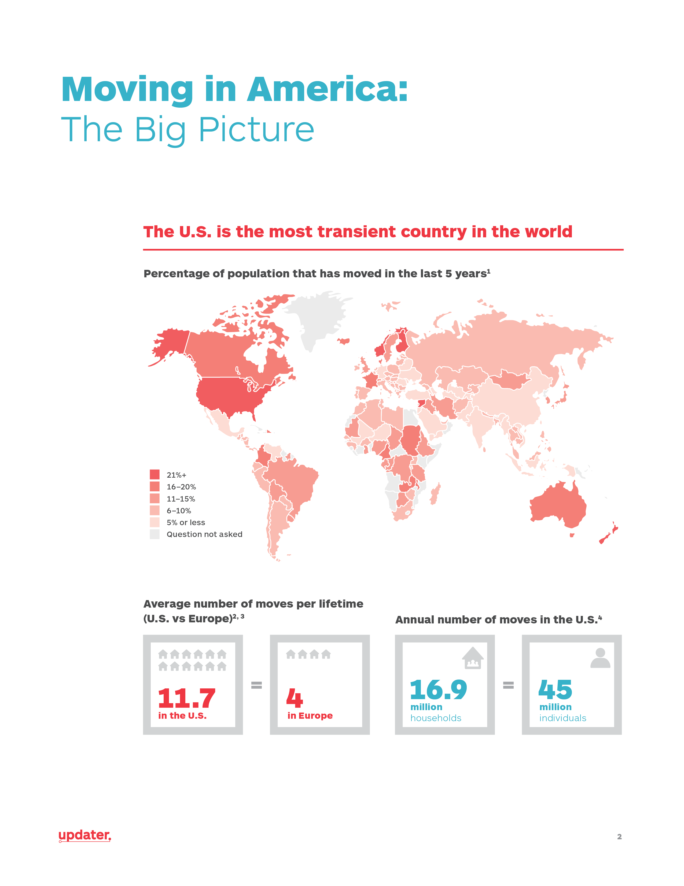
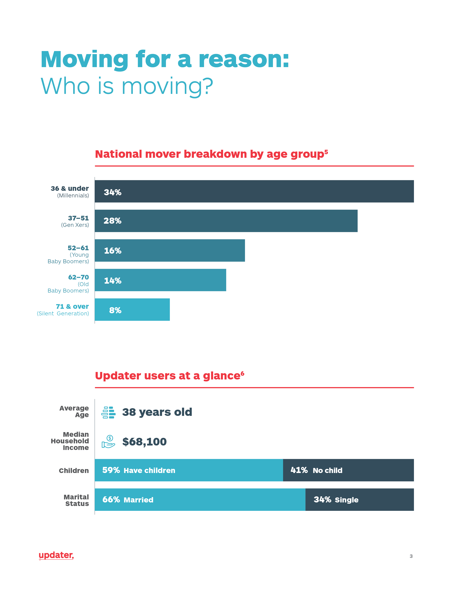
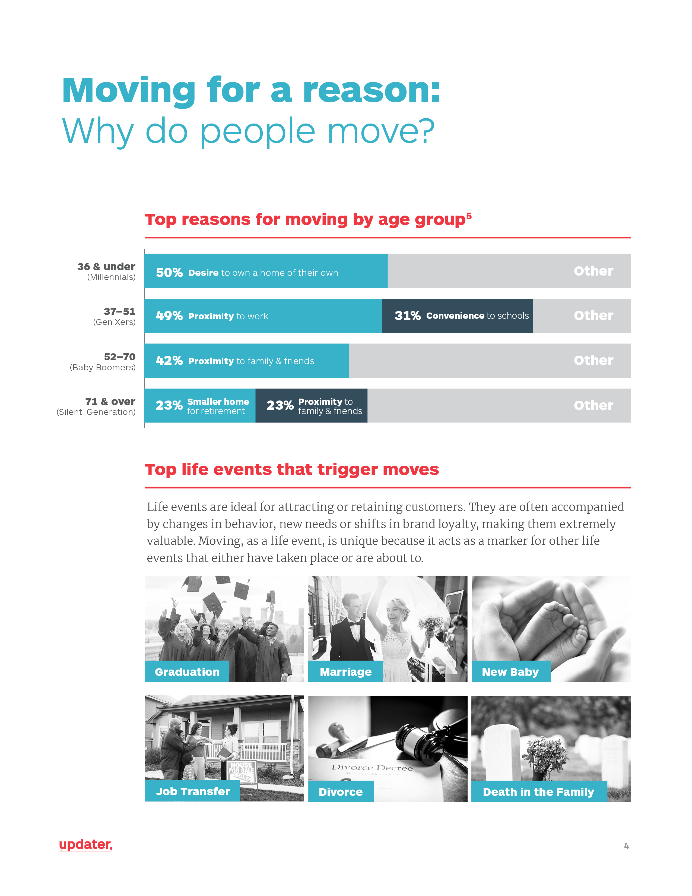
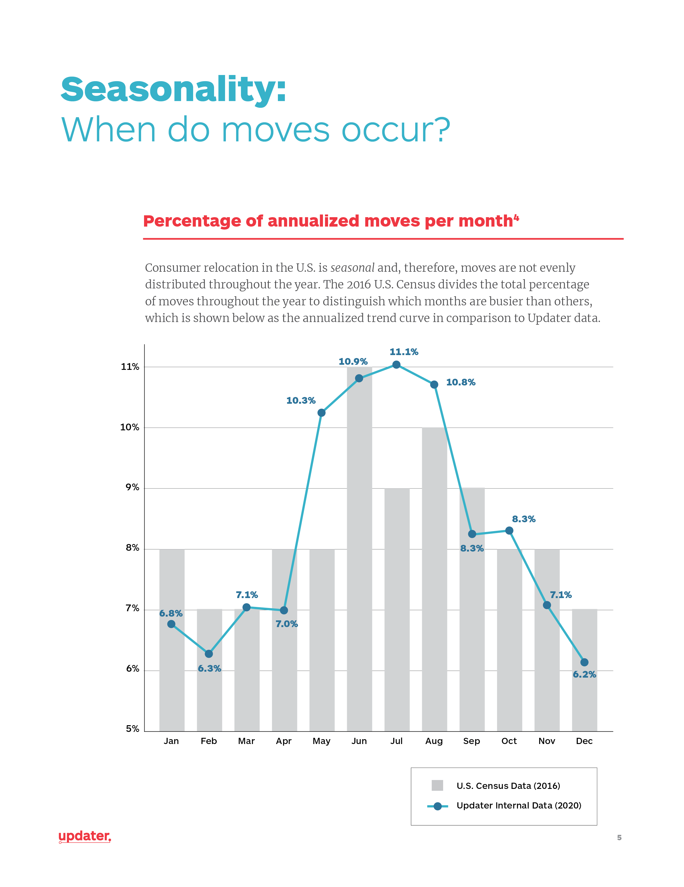
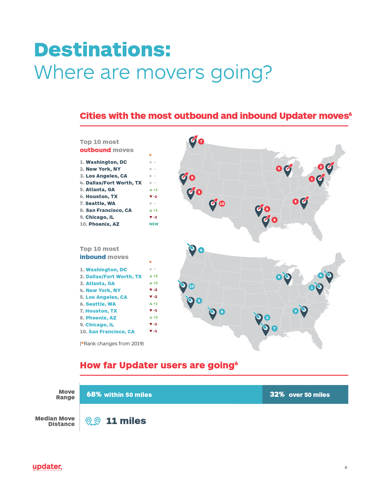
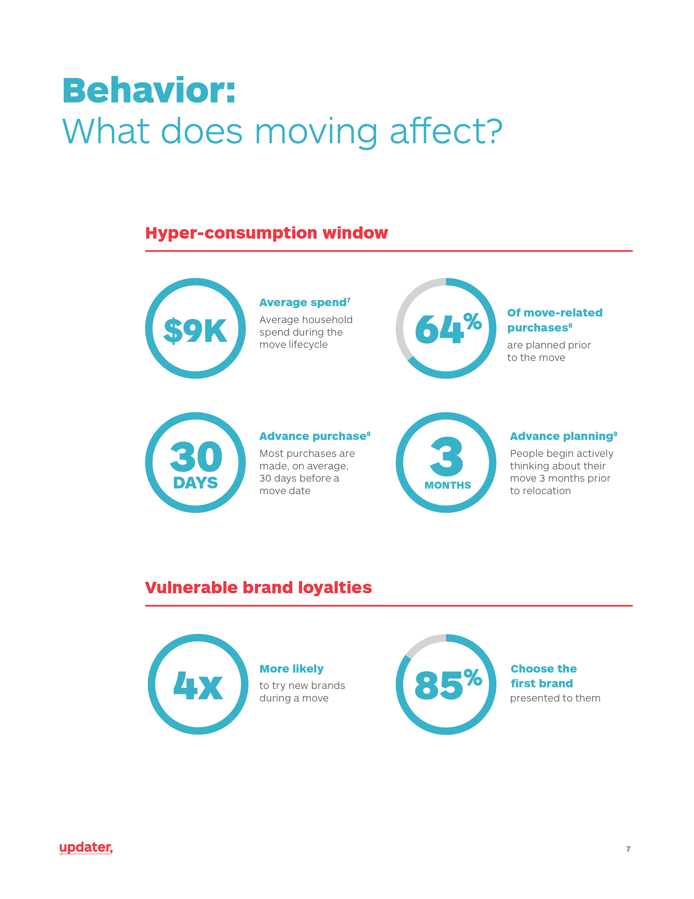
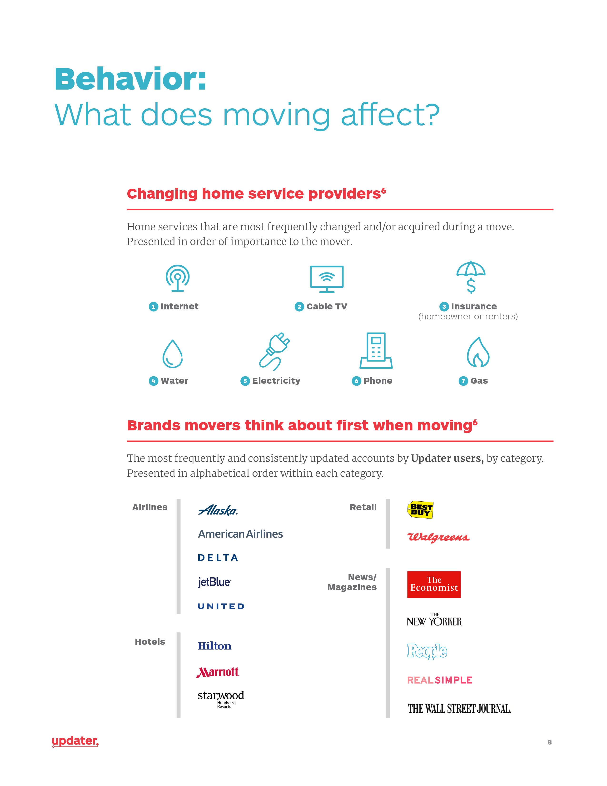
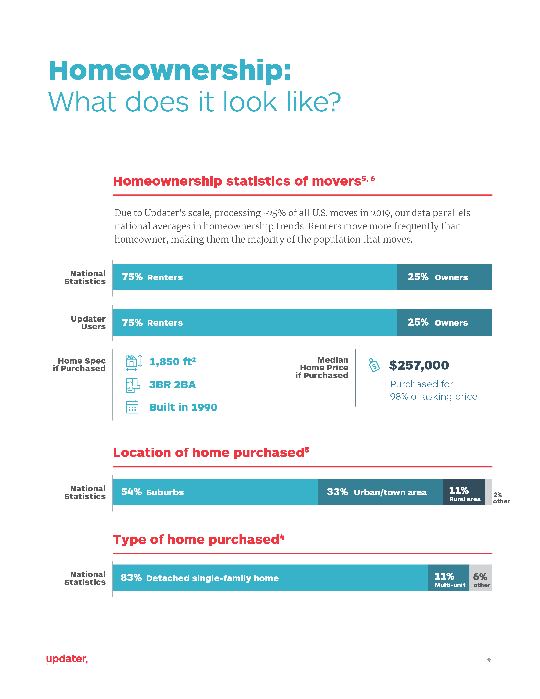

<section class="portfolioDetail">

### roles

designer

</section>

<section class="portfolioDetail">

### employer

[Updater](https://updater.com)

</section>

<section class="portfolioDetail">

### overview

Updater has a truly unique first-party data set about all American moving patterns. Starting in 2019, Updater started publishing some of its learnings. I have helped curate and present the data in narrative format, and also designed the final reports.

</section>

---

