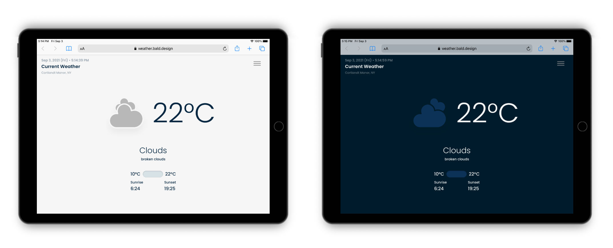
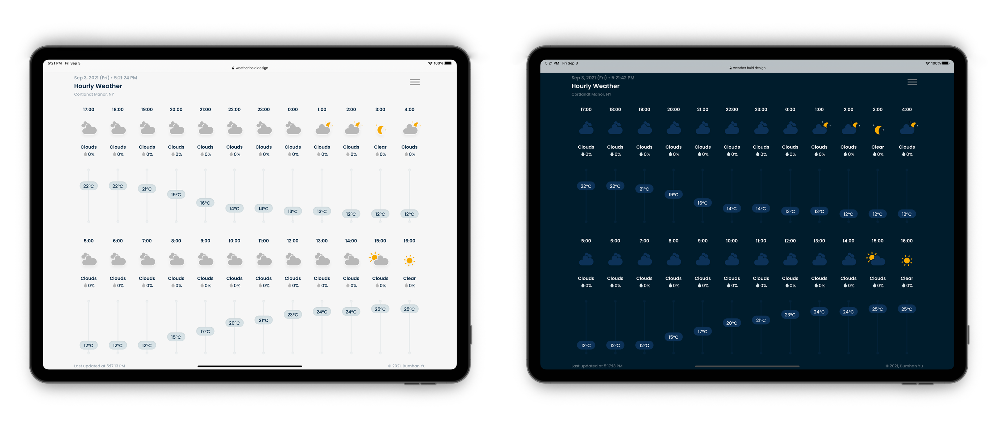
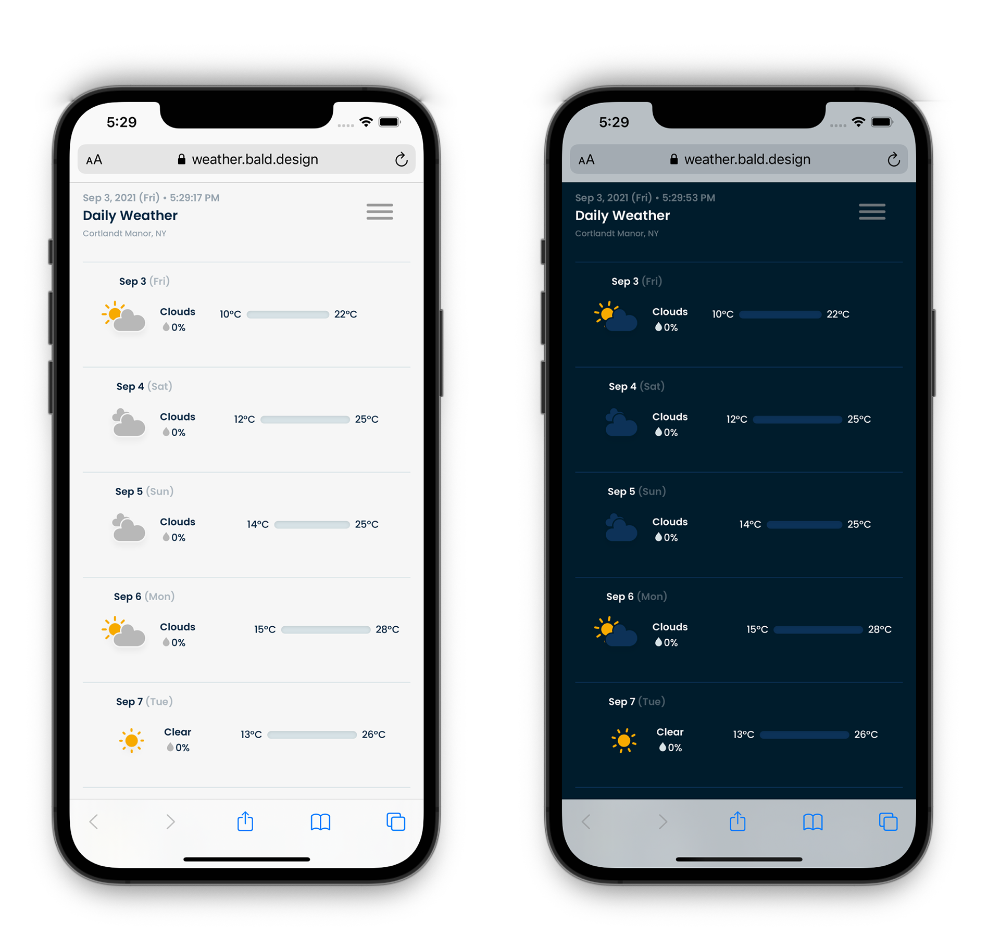

import { WeatherIcons } from "../../components/WeatherIcons/WeatherIcons";
import { SimpleButton, ButtonContainer } from "../../components/SimpleButton";

<section class="portfolioDetail">

### client

Self-initiated, open source

</section>

<section class="portfolioDetail">

### roles

Design, development

</section>

<section class="portfolioDetail">

### built with

`React`, `Gatsby`, <small>SVG/CSS</small> animation, Open Weather <small>API</small>

</section>

<section class="portfolioDetail">

### Background

While weather forecast is usually only a tap away, no single weather app presented the particular set of information I'm interested in the particular way I want them. Using the [OpenWeather API](https://openweathermap.org/) I built a custom weather station to always provide the family with a straightforward forecast for the hour.

</section>

<section class="portfolioDetail">

### Key Features

- Light & dark mode

- Animated weather icon

- At a glance view of:
  - Current weather and sunrise/sunset time of the day
  - Highest and lowest daily temperature for the next 7 days
  - Average hourly temperature for the next 24 hours
  - Precipitation prediction for upcoming hours and days

</section>

<ButtonContainer>
  <SimpleButton
    cta="Launch live app"
    href="https://weather.bald.design"
    variant="yellow"
  />
  <SimpleButton
    cta="View GitHub Repo"
    href="https://github.com/baadaa/weather-station"
    variant="green"
  />
</ButtonContainer>

---

### Animated icons with dark mode support

<WeatherIcons />

_SVG weather icons in CSS animation (modified from [amCharts](https://www.amcharts.com/free-animated-svg-weather-icons/) graphics)_

 

### Viewing modes: current, hourly, and daily

_Current weather: light and dark mode_

_Hourly forecast for the next 24 hours: light and dark mode_

_Daily forecast for the next 7 days: light and dark mode_

<ButtonContainer>
  <SimpleButton
    cta="Launch live app"
    href="https://weather.bald.design"
    variant="yellow"
  />
  <SimpleButton
    cta="View GitHub Repo"
    href="https://github.com/baadaa/weather-station"
    variant="green"
  />
</ButtonContainer>
