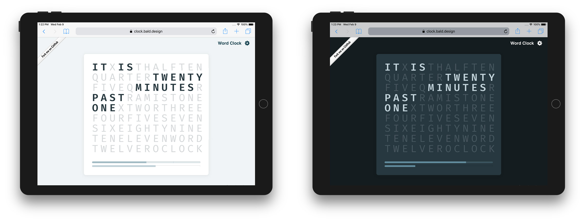
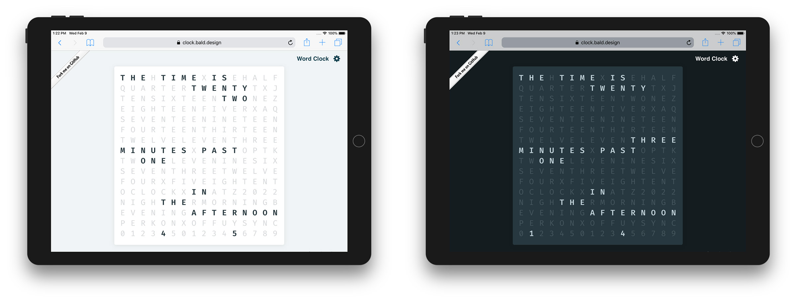
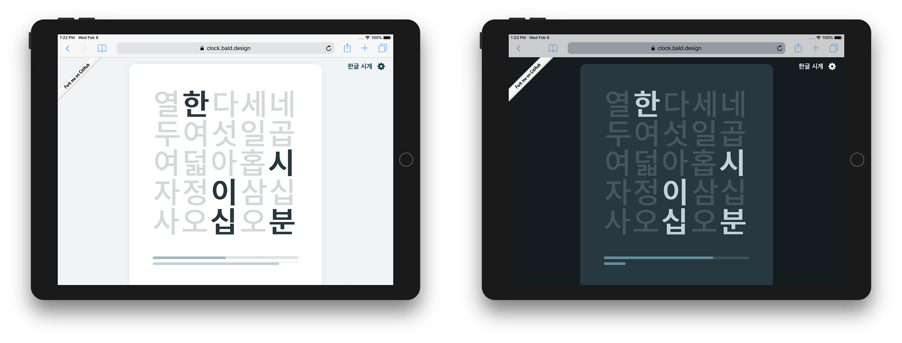

import { SimpleButton, ButtonContainer } from "../../components/SimpleButton";

<section class="portfolioDetail">

### client

Self-initiated

</section>

<section class="portfolioDetail">

### roles

Design, development

</section>

<section class="portfolioDetail">

### built with

`React`, `TypeScript`

</section>

<section class="portfolioDetail">

### Background

Looking at a few examples of similar word clocks—e.g. [here](https://www.instructables.com/A-Word-Clock/), [here](http://www.brettoliver.org.uk/Word_Clock/Word_Clock.htm?i=1), and [here](https://www.wadiz.kr/web/campaign/detail/1240)—I decided to build my own version that combines all three, with a little personal touch to it.

</section>

<section class="portfolioDetail">

### Key Features

- Light & dark mode

- Bilingual output in English and Korean

</section>

<ButtonContainer>
  <SimpleButton
    cta="Launch live app"
    href="https://clock.bald.design"
    variant="yellow"
  />
  <SimpleButton
    cta="View GitHub Repo"
    href="https://github.com/baadaa/word-clock-react"
    variant="green"
  />
</ButtonContainer>

---

### Viewing modes: _Simple English, Precise English, and Simple Korean_

_Simple Enligh: light and dark mode (modified from [an Instructables article](https://www.instructables.com/A-Word-Clock/))_

_Precise English: light and dark mode (modified from [an Arduino word clock](http://www.brettoliver.org.uk/Word_Clock/Word_Clock.htm?i=1))_

_Simple Korean: light and dark mode (modified from [a Korean word clock project](https://www.wadiz.kr/web/campaign/detail/1240))_

<ButtonContainer>
  <SimpleButton
    cta="Launch live app"
    href="https://clock.bald.design"
    variant="yellow"
  />
  <SimpleButton
    cta="View GitHub Repo"
    href="https://github.com/baadaa/word-clock-react"
    variant="green"
  />
</ButtonContainer>
