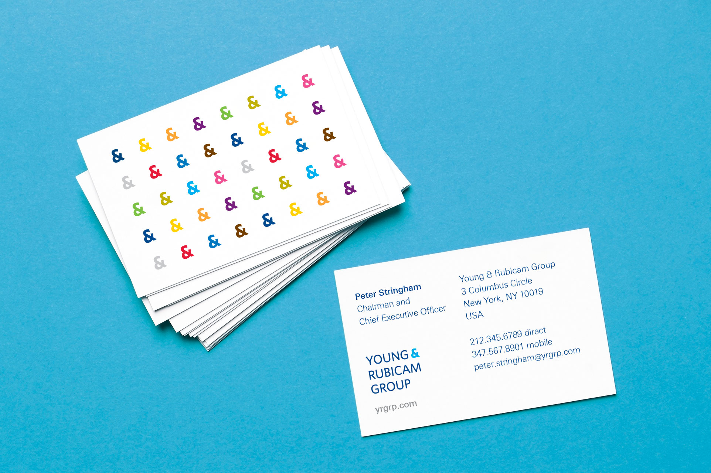
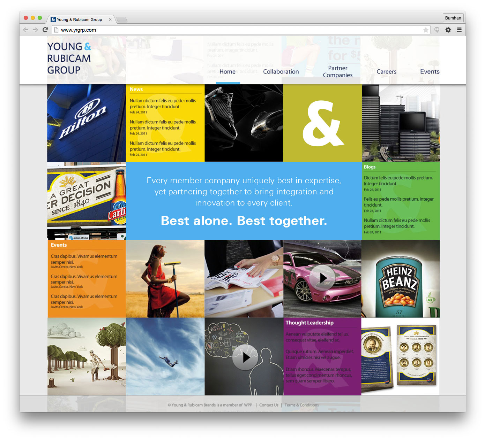
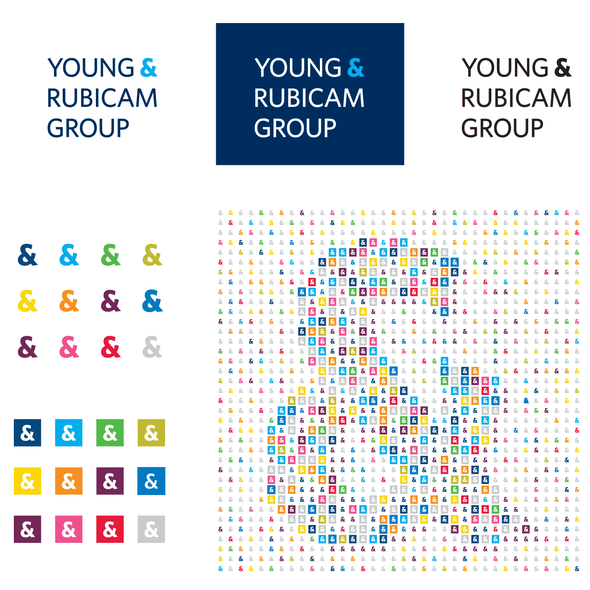
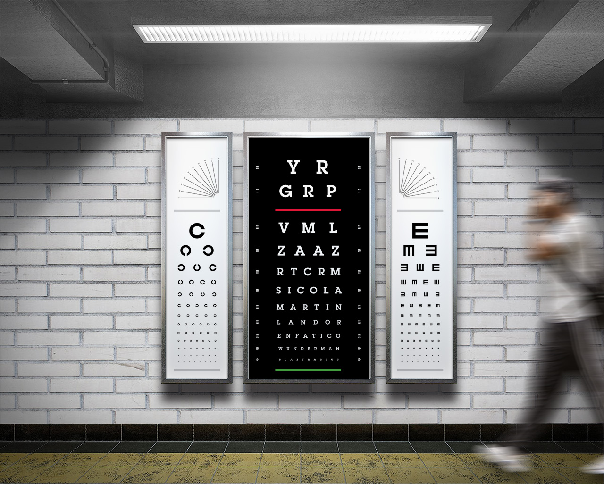
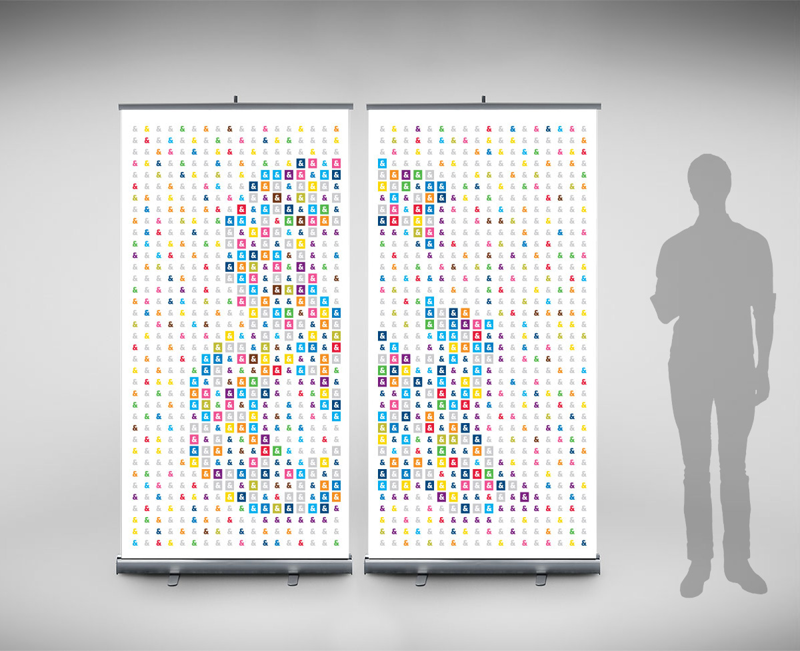
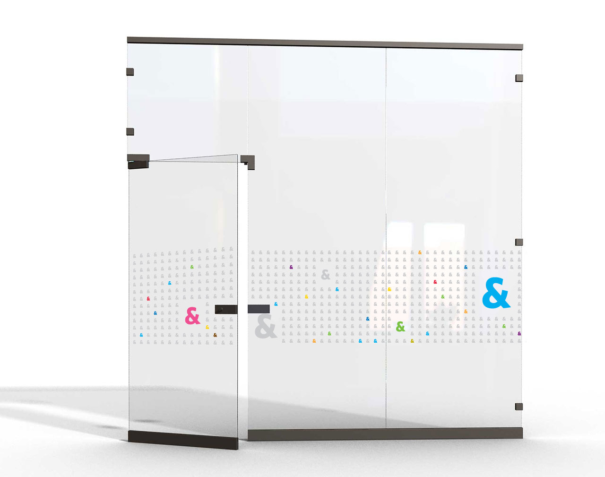
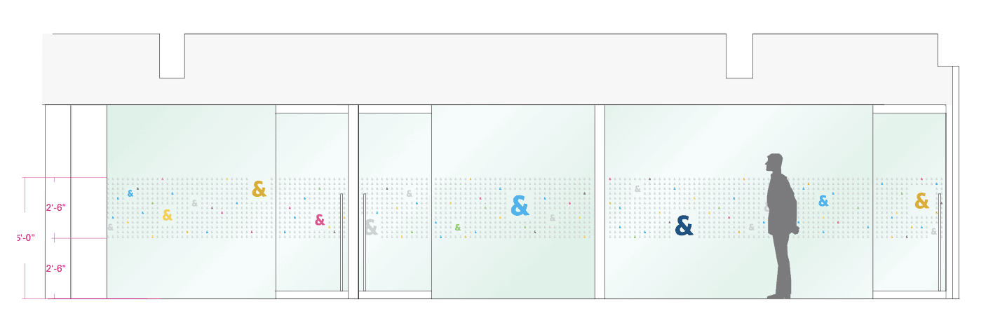
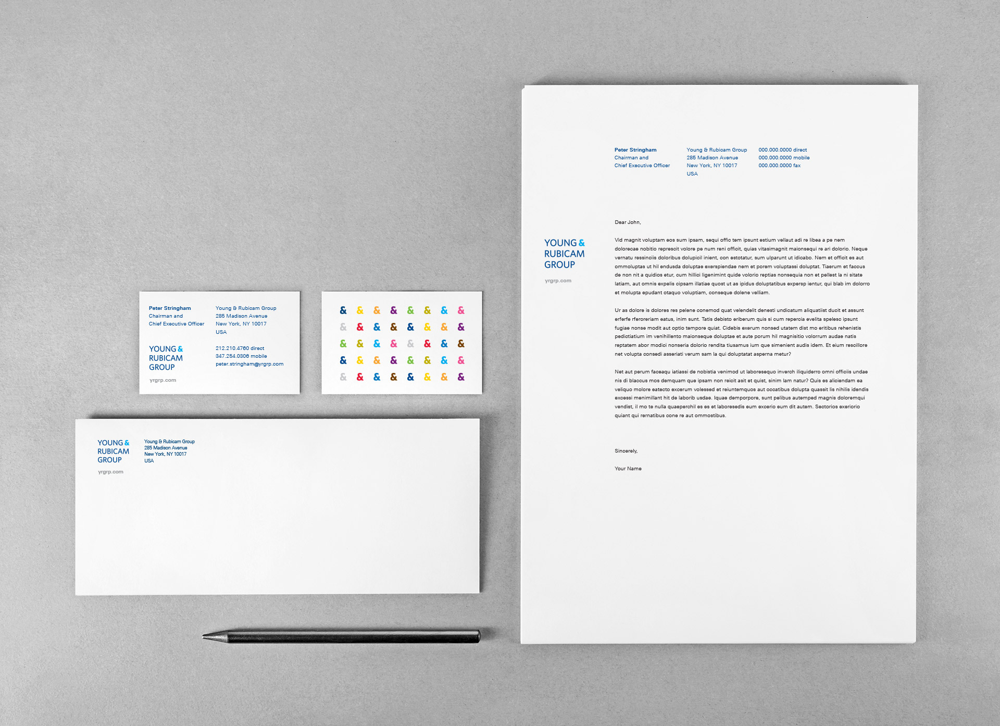

import EmbedVideo from "../../components/EmbedVideo";

<section class="portfolioDetail">

### agency

[Young & Rubicam Group](http://yrgrp.com) w/ [Landor Associates](https://landor.com)

</section>

<section class="portfolioDetail">

### Challenge

Going through a name change from _Young &amp; Rubicam Brands_ to _Young &amp; Rubicam Group_, the firm needed a new visual identity system developed. A holding company consisting of top-notch agencies in premium marketing and communications services, they hoped to better signal the unified platform for the partner companies without overpowering individual brand visual identities.

</section>

<section class="portfolioDetail">

### Solution

Under the main creative direction—_the use of ampersand to communicate collectivity and multi-color palette to celebrate the variety_—I first developed the color scheme in collaboration with Landor Associates. Once the logotype and ampersand graphic established, I worked closely with Global Brand Officer to create a series of real-life applications: from stationery sets to corporate events, to interactive web apps, and to interior/exterior signage systems. The overarching visual concept was the multiplicity of ampersands in vibrant colors to communicate _a wide range of expertise in unison_

</section>

---

_Business cards_

_Website layout_

_Identity graphics_

<EmbedVideo
  aspectRatioPadding="56.34"
  videoChannel="vimeo"
  videoId="43983326"
/>

_Global Leaders Forum: event preparation, posters, video editing (type work)_

_Conceptual posters to promote partner companies_

_Standing banners_

_Glassdoor markers_

_Interior drawing_

_Corporate stationery set_
